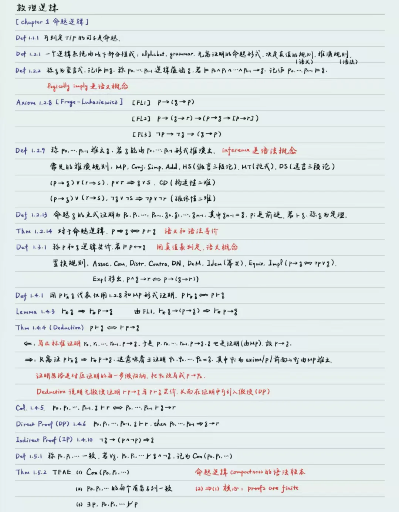
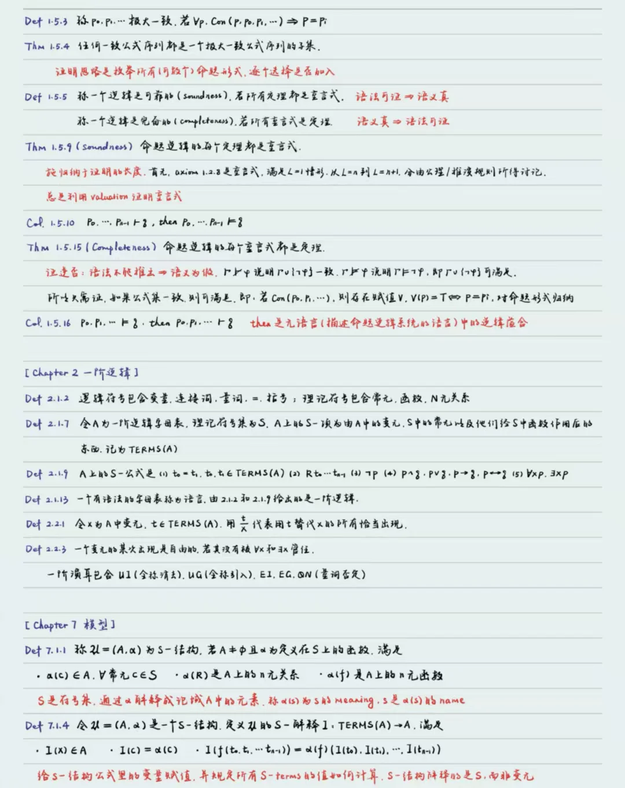
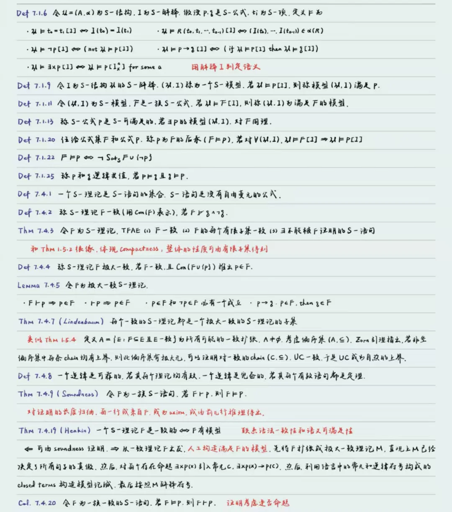
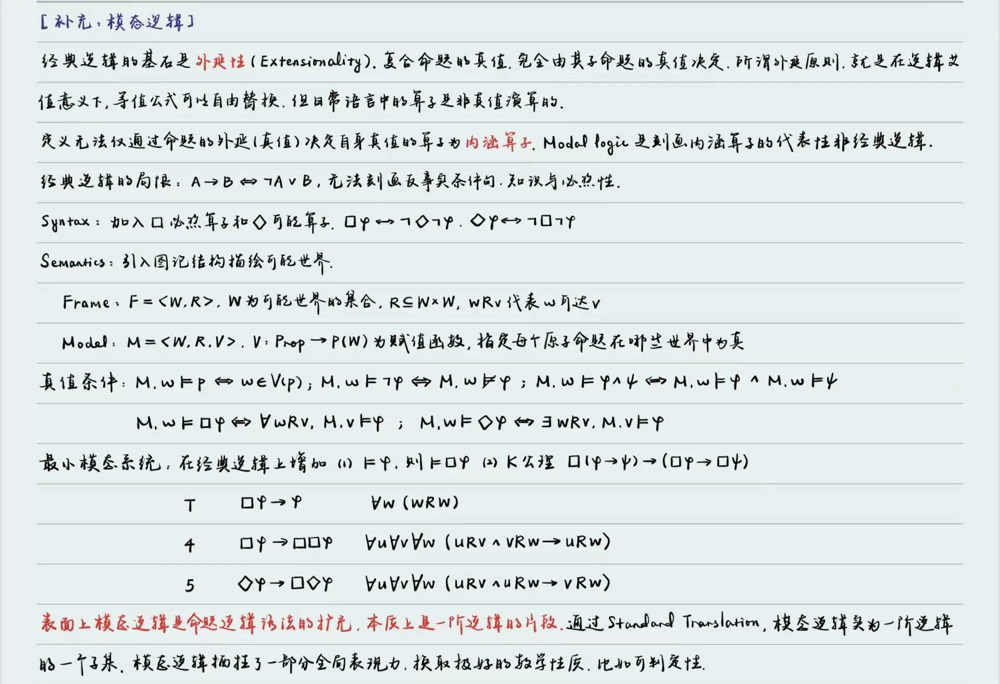

本来数理逻辑由计算机学院和哲学学院双聘教授廖备水老师授课（很神秘的头衔），但25-26夏廖老师太忙，于是实际授课老师为洪峥怡老师。本学期没有任何课前测，洪老师看起来很年轻的样子，对点到也比较宽容，相信年轻老师给分也会宽宽容容的。

数理逻辑是一门系统性很强的课程，具有不低的本质难度，但比浮躁繁杂的工科课程学起来舒服。配套教材为 Michael L. O'Leary - A First Course in Mathematical Logic and Set Theory，就算上课完全听不懂，也可以参照这本教材自学。课程主要内容为：

- **命题逻辑**：证明规则，证明方法，可靠性，完备性；
- **一阶逻辑**：证明规则，一阶逻辑元理论（结构，模型，解释，可靠性，完备性等）；
- **模态逻辑**：作为补充，不作为考试内容；

笔者以为，元理论之外的内容，首要是厘清**语义**（semantics）和**语法**（syntax）两条主线。关于元理论，最终目标是**可靠性**（soundness）和**完备性**（completeness），则可以反复多次阅读理解证明的 main idea，适当放过技术性的细节，最终可以读懂。恰好笔者这个学期还修读点集拓扑，这两门的研究对象隐隐有一些共通之处，神奇而有趣。

考试形式为8个选择题，3个简答题考察概念，4个形式证明题，3个综合题。

以往关于数理逻辑的资源较少。笔者先提供个人的笔记，如若有空还会补充一些习题。**希望以后对逻辑感兴趣的同学可以放心大胆地选这门课**！

