> 高帆叔叔是神！！！

选点集拓扑当跨专业！北大强基面试时，白发苍苍的老爷爷问我你对什么方向感兴趣。当时什么都不懂的我说对拓扑感兴趣。老师问，那你学过吗，我说暂时没有，然后老师推荐了一本俄罗斯人写的拓扑讲义。后来阴差阳错来浙读了工科，直到二年级才终于学上了拓扑，也算是完成了高中的夙愿！

完整详尽的知识梳理已有前辈给出：[点集拓扑笔记整理（已完成）](https://www.cc98.org/topic/6543280)。

工学的特点是重视经验，不重证明。前辈们说每周至少要额外花四个小时学习点集拓扑，笔者囿于各种杂事，在完成回家作业之外就没有额外花过时间，导致期中考试时只能意会证明的大体思路但很难用严谨的语言书写过程。复习后，点集拓扑的概念笔者已然大致清晰，但在做题时仍常常没有思路。因此，从做题的角度出发，笔者分模块**重新整理了课后习题、上课笔记和期中试题**，对有难度的题目给出了比较详细的证明。哪里不清楚，就写一写证明，目的是理解所谓的 main idea 和证明的动机。

模块如下：

- **Problems with product topology**：固定某个参考点，构造 finitely many 集合是一种很常见的手法；
- **Problems with Separation Axiom**：明白 T0、T1、T2、T3、T4、regular、normal 之间的关系，以及它们各自针对的对象；
- **Problems with countable, separable, compact**：理解 1st/2nd countable、separable、Lindelöf、sequential compact、closed and bounded 之间的关系；
- **Problems with connectivity and continuous mapping**：通过构造连续映射说明 countable、open、closed 之间的联系；
- **杂题**：考验人类智慧！

时间实在有限。Munkres 教材上的第 13、16、17、18、19、20、23、24、25、26、27、28、29、30、31、32 章的一些章后习题全部放在杂题中，没有再进行分类整理。

点集拓扑给我的感觉是，**要么根据层层叠叠的定义在 open 和 closed 之间来回推导，要么尝试构造 countable 的对象，要么利用连续映射建立不同拓扑之间的联系。**所以，基本功就是熟悉各个概念，以及有自信能独立推导出概念之间的简单关系。需要巧思的部分（比如 sequential compact ⇒ compact、Urysohn lemma）本人力有所不逮。在此基础上，熟悉一些常用的引理可以培养一些直觉，虽然在拓扑中最好不要直接相信直觉。上课讲过很多引理，很多我也无法独立复写。兵临城下，还是回归基础叭。

## Product Topology

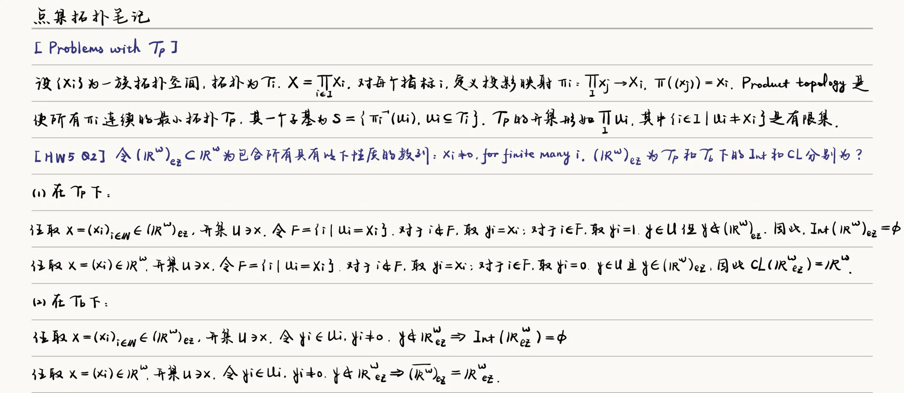
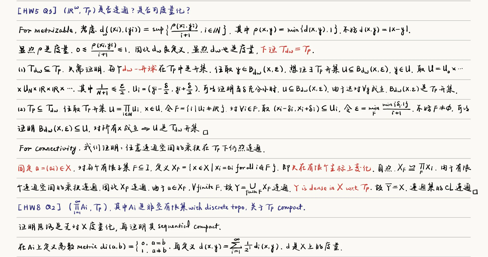
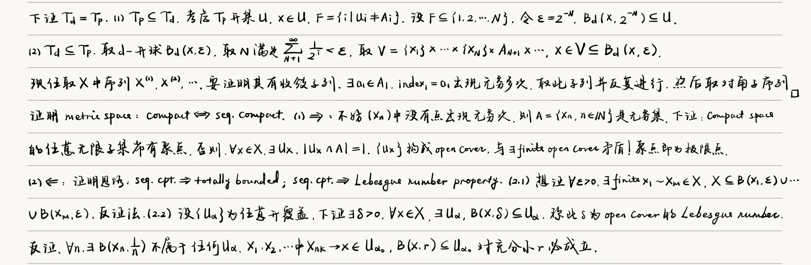
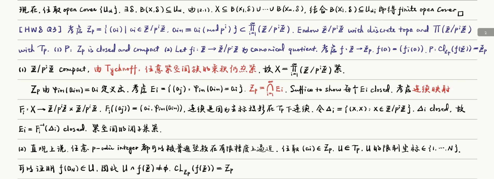
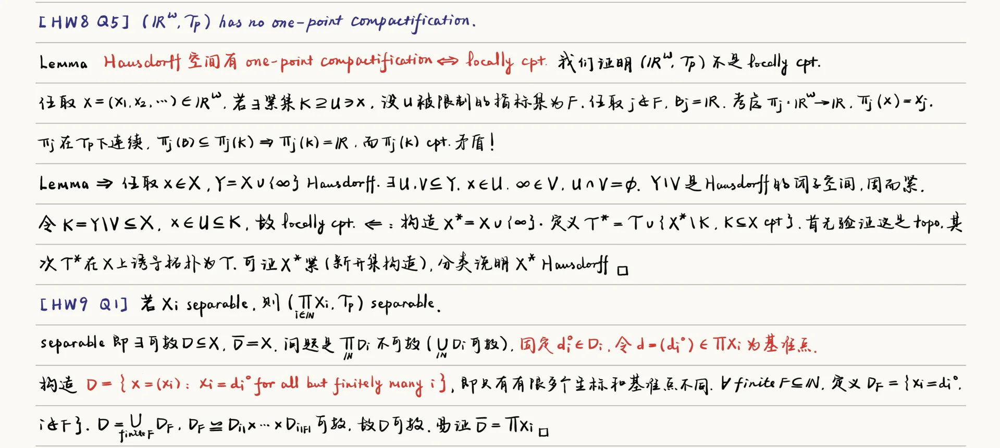

## Separation Axiom

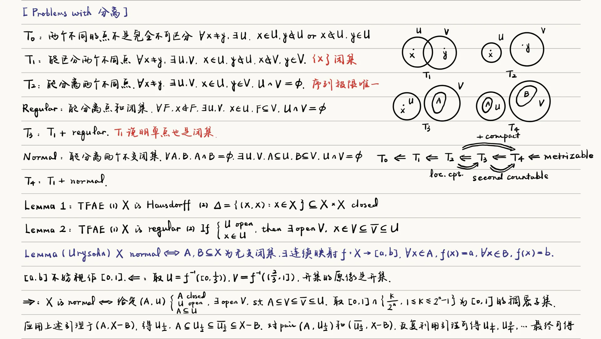
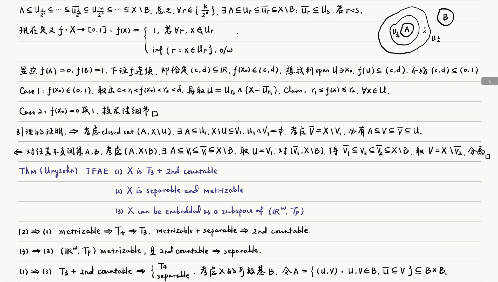

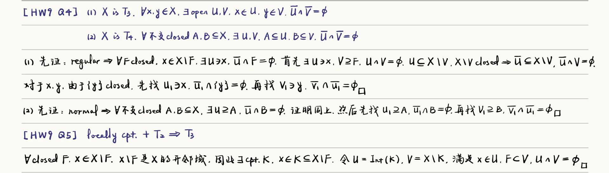

## Countable, Separable, Compact

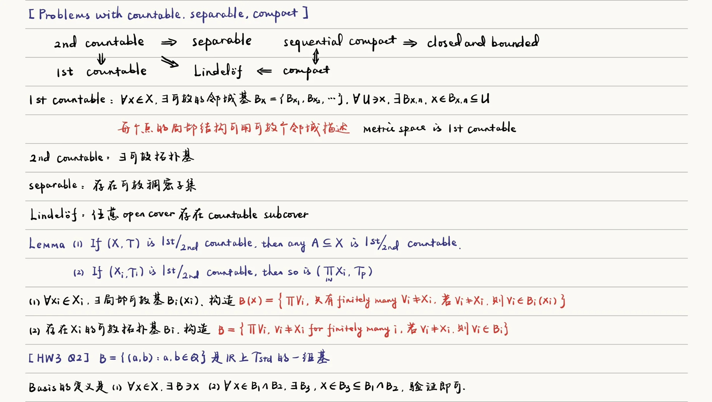
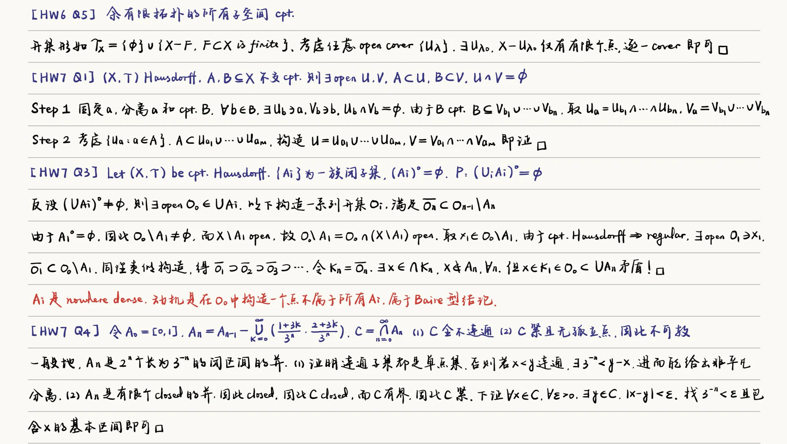
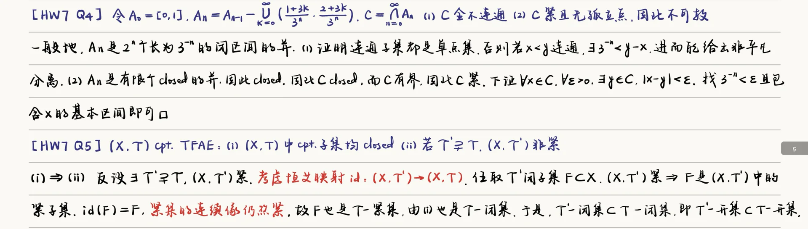
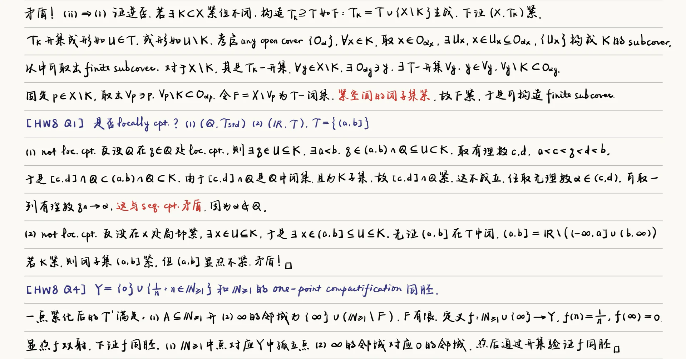
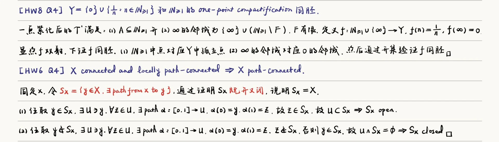

## Connectivity and Continuous Mapping

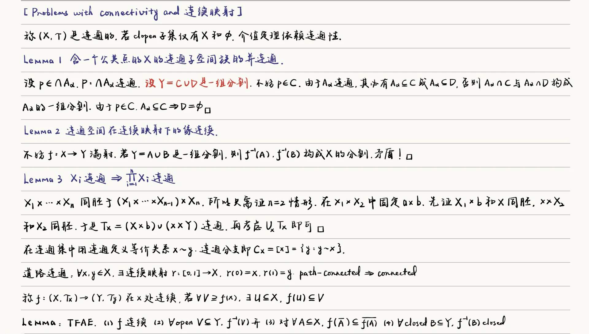
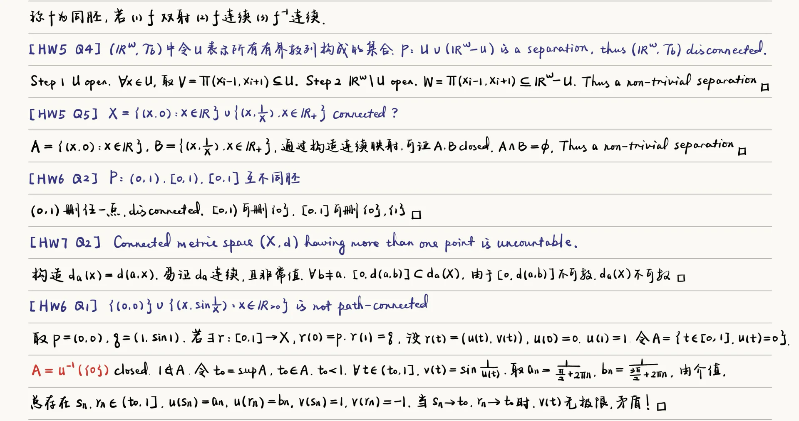

## 杂题

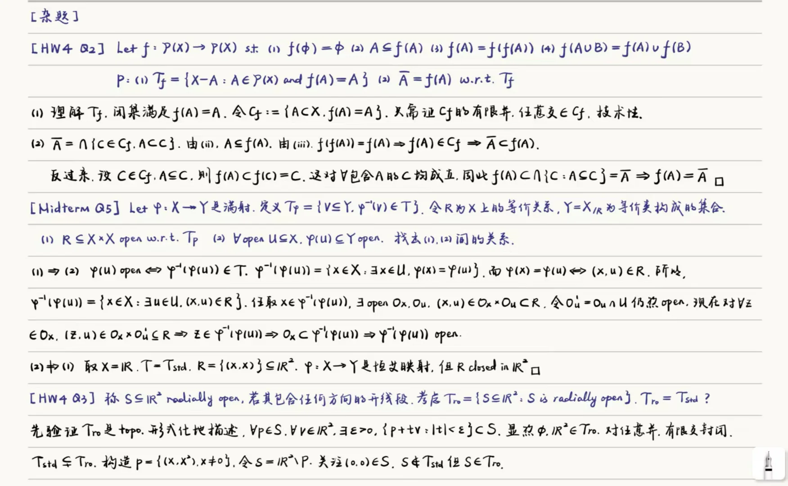
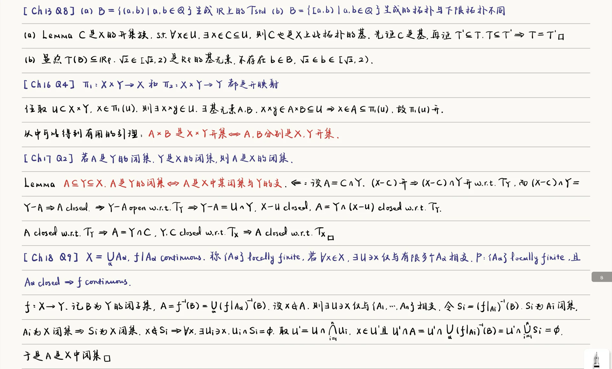
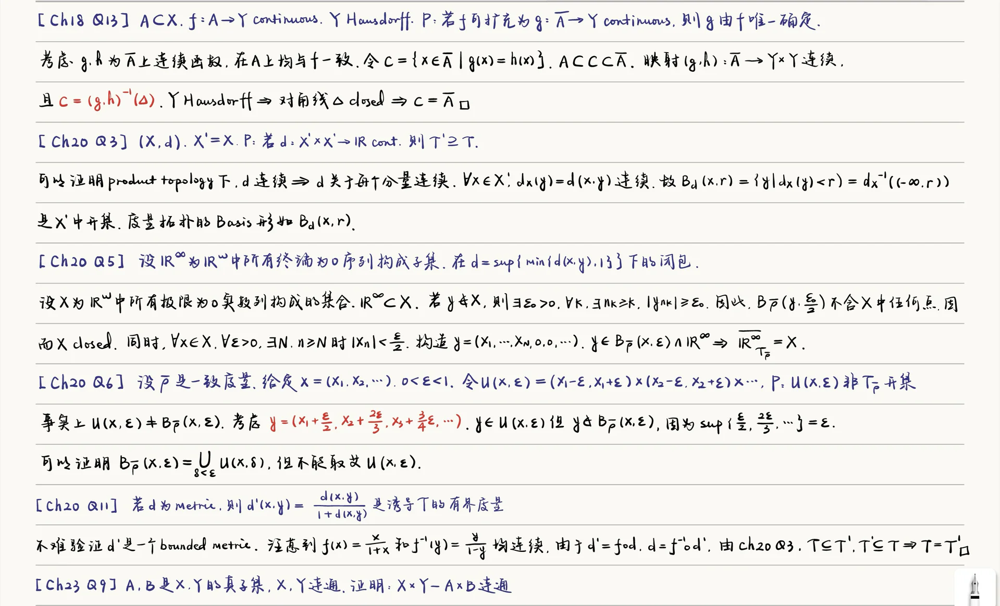
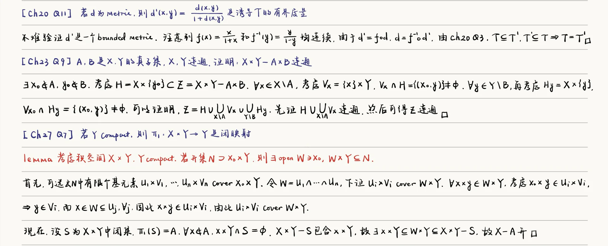
