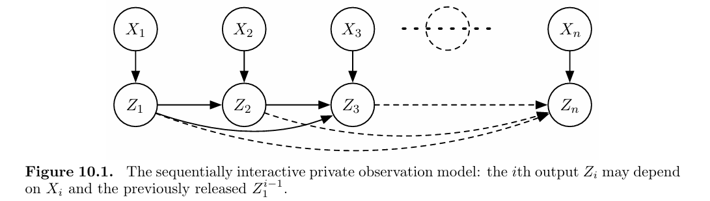
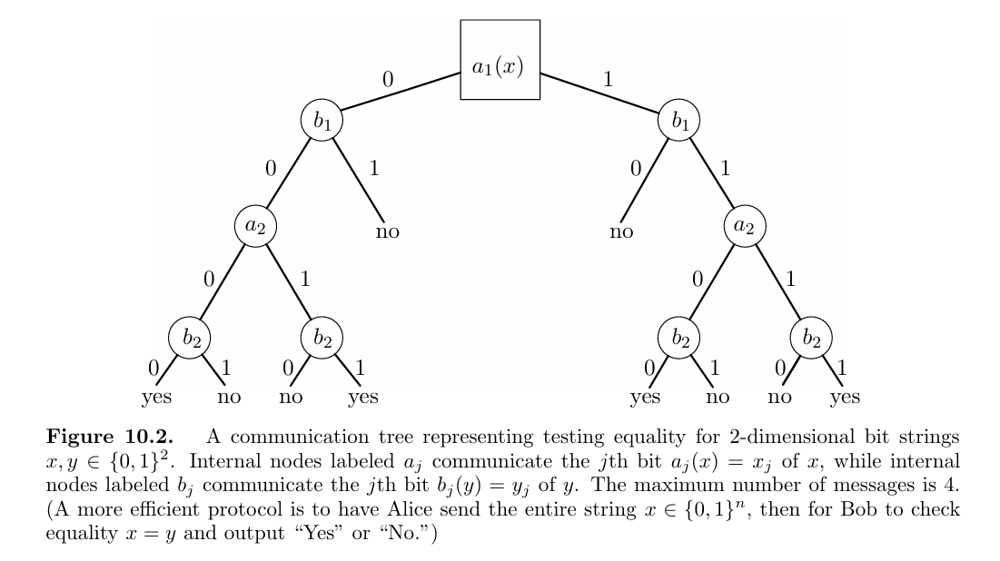
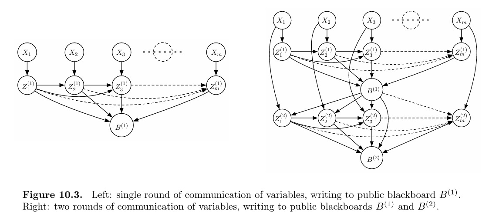

# Estimation and Generalization

## Uniformity and Metric Entropy

对于一族函数 $f:\mathcal{X} \to \mathcal{Y}$ 中的某个固定的 $f$，令 $Y_f = f(X)$ 大数定律告诉我们 $ P(\limsup_{n \to \infty} |\overline{Y_f}-Y_f|=0)=1 $

我们希望上式关于 $f$ 一致成立。

对于 $f: \mathcal{X} \to \mathbb{R} \in \mathcal{F}$，定义 $ P_n f =\mathbb{E}_{P_n} [f(X)]=\frac{1}{n} \sum_{i=1}^n f(X_i) $

Glivenko-Cantelli 定理考虑了对原始分布的一个经验估计，在 $\mathcal{F}=\{f_x | f_x (X)=\mathbf{1}(X\le x)\}$ 下给出经验均值的一致收敛性： $ \sup_{f \in \mathcal{F}} |P_n f - P f| \to 0 $

考虑更广泛的版本，若 $f: \mathcal{X} \to [a,b]$ 为有界函数集合，则有 $ P\left(\|P_n -P\|_{\mathcal{F}} \ge \mathbb{E}(\|P_n - P\|_{\mathcal{F}})+t\right)\le \exp\left(-\frac{2n t^2}{(b-a)^2}\right) $

这里是把 $\sup$ 视为一个范数，从而利用 vector tensorization 将目标从 high prob bound 变成 in-expectation bound，即证明 $\mathbb{E}(\|P_n - P\|_{\mathcal{F}})=o(1)$。

证明用到 bounded differences inequality。上述结论说明，如果我们想要研究"经验分布"是否能够良好地表示原始分布，只需要研究均值即可，因为稳定性（有界差分条件）可以确保集中性。

不过原始分布 $P$ 很难知道，所以我们引入对称化的技巧来显式的消去原始分布 $P$，引入 $\epsilon \in \{-1,1\}$，可以得到对任意的 $p\ge 1$： $ 2^{-p} \mathbb{E}\left[\left\|\sum_{i=1}^n \epsilon_i (X_i - \mathbb{E}[X_i])\right\|^p\right] \le \mathbb{E}\left[\left\|\sum_{i=1}^n (X_i - \mathbb{E}[X_i])\right\|^p\right]\le 2^p \mathbb{E}\left[\left\|\sum_{i=1}^n \epsilon_i X_i\right\|^p\right] $

也可以引入 Rademacher 复杂度 $ P_n^0 = \frac{1}{n} \sum_{i=1}^n \epsilon_i \mathbf{1}_{X_i},\quad R_n = \mathbb{E}(\sup \|P_n^0 f\|) $

代表对称经验测度关于符号变量 $\epsilon_i$ 的期望。如果 $X_i$ i.i.d.，有 $ \mathbb{E}[\|P_n - P\|_{\mathcal{F}}]\le 2 \mathbb{E}[\|P_n^0\|_{\mathcal{F}}] $

对于有界的 $f: \mathcal{X} \to [a,b]$，上式立即可以导出 $ P\left(\|P_n - P\|_{\mathcal{F}} \ge 2\mathbb{E}[\|P_n^0\|_{\mathcal{F}}]+t\right) \le \exp\left(-\frac{2 n t^2}{(b-a)^2}\right) $

有关 Rademacher 复杂度，有以下结果，比如 Massart's finite class bound： 如果 $\sigma_n^2 = n^{-1} \mathbb{E}[\max_{f \in \mathcal{F}} \sum_{i=1}^n f(X_i)^2]<\infty$，则 $ R_n (\mathcal{F}) \le \frac{\sqrt{2 \sigma_n^2 \log |F|}}{\sqrt{n}} $

它给出了一个有限函数族拟合随机噪声的能力上限，和 $\log |F|$ 与 $1/\sqrt{n}$ 相关。

Ledoux-Talagrand Contraction 给出，对于任意的 $T \subset \mathbb{R}^n$ 和满足 1-Lipschitz 且 $\phi_i (0)=0$ 的函数 $\phi_i: \mathbb{R} \to \mathbb{R}$，对于任意不减的凸函数 $\Phi: \mathbb{R} \to \mathbb{R}_+$， $ E\left[\Phi\left(\frac{1}{2} \sup_{t \in T} \left|\sum_{i=1}^n \phi_i(t_i)\epsilon_i \right|\right)\right] \le E[\Phi(\sup_{t \in T}\langle t, \epsilon\rangle)] $

其推论是，对于任何函数集 $\mathcal{F}$ 和 L-Lipschitz 函数 $\phi$，均有 $ R_n (\phi \circ \mathcal{F})\le 2 L R_n (\mathcal{F}) + \frac{|\phi(0)|}{\sqrt{n}} $

其意义是，在机器学习中我们关心的往往不是 $f(X)$ 本身的复杂度，而是损失函数 $l(f(X),Y)$ 的复杂度。但只要 $l$ 满足 Lipschitz 条件，我们就可以利用上述不等式，只需关注 $f(X)$ 本身的复杂度。它也揭示了 Rademacher 复杂度对被有界梯度的函数 $\phi$ 复合后的鲁棒性。

如果 $|\mathcal{F}|$ 无穷大怎么办？可以引入 covering 和 packing 的概念。用 $N(\delta, \Theta, \rho)$ 表示可以用最少 $N$ 个小"圆盘"覆盖整个 $\mathcal{F}$，使得对于任意 $\theta$，存在 $\rho(\theta, \theta_i)<\delta$。

用 $M(\delta, \Theta, \rho)$ 表集合中可以放下的最多的 $M$ 个互不相交的距离为 $\delta$ 的小圆盘的数量。它们之间满足 $ M(2\delta, \Theta, \rho)\le N(\delta, \Theta, \rho)\le M(\delta, \Theta, \rho) $

如果 $\mathcal{F}$ 是所有 $f: \mathcal{X} \to [-b,b]$ 上的函数，度量 $\rho$ 是 $\|f-g\|_{\infty}=\sup_{x \in \mathcal{X}}|f(x)-g(x)|$，则 $ P\left(\sup_{f \in \mathcal{F}}|P_n f - P f|\ge t\right)\le \exp\left(-\frac{n t^2}{18b^2} + \log N(t/3, \mathcal{F}, \|\cdot\|_{\infty})\right) $

## Generalization Bounds

在机器学习任务中，我们希望找到一个函数，能够很好的解释原始分布的机制。比如有一个输入为 $X$，输出 $Y \in \{-1,1\}$ 的黑盒，如果我们能找到一个 $f$ 满足 $f(X)>0 \Rightarrow Y=-1, f(X)<0 \Rightarrow Y=1$，我们就相当于理解了这个黑盒的机制。

一般我们能做的是：确定 $f$ 可能的范围 $\mathcal{F}$，或者利用黑盒重复采样。对于每个 $f$，我们定义 $l_f (Z)$ 来衡量 $f$ 有多好。之前的理论告诉我们，在某些条件下分布对其均值有良好的集中性，且经验分布可以很好地还原原始分布，所以我们考虑经验风险 $\hat{L}_n (f)=\frac{1}{n} \sum_{i=1}^n l(f, Z_i)$。如果找到了合适的 $f$，使得经验风险接近于原始分布的风险，那就是实现了泛化。

我们的终极目标是对于每一个 $f$，定量证明 w.h.p.(with high probability) $|\hat{L}_n (f) - L(f)| = o(1)$，其中 $o(1)$ 和 $f$ 的具体性质有关。这个问题的一个简化版本是找到一个一致上界 $ P\left(\sup_{f \in \mathcal{F}}|\hat{L}_n (f) -L (f) |>t\right) $

其中的 $f$ 可被视为一个探测函数。

当 $|\mathcal{F}|$ 可数时，$P$ 是 $\mathcal{Z}$ 上的一个分布， 若 $l(f,Z)$ 满足对所有 $f$ 均是 sub-Gaussian，而且给每一个 $f$ 给出一个编码 $c(f)$ 满足 $\sum_f e^{-c(f)}\le 1$，则下式有 $1-\delta$ 的概率在 $Z_{1:n}$ 成立： $ L(f)\le \hat{L}_n (f) + \sqrt{\frac{2 \sigma^2 (\log 1/\delta + c(f))}{n}} $

这里的 $c(f)$ 表示 prior complexity。从信息论的视角看，我们希望使用一套编码系统把每一个 $f$ 都记录下来，$c(f)$ 就是分配给 $f$ 的编码长度，结构越简单的模型 $f$ 对应的 $c(f)$ 越短。证明中，我们给简单的模型多分配一点容错率，给复杂的模型少分配一点。我们给模型 $f$ 分配的单边失败概率正是 $\delta \cdot e^{-c(f)}$。

如果 $\mathcal{F}$ 不可数，处理起来就很复杂，或者使用 Rademacher 复杂度建模，或者使用覆盖数建模。其内容比较复杂，在此省略。

## Beyond Uniform Convergence: PAC-Bayes

uniform convergence 的目标是：w.h.p. $\sup_{f \in \mathcal{F}} |P_n f - P f|=o(1)$。我们说明了其收敛的速度与 $|\mathcal{F}|$ 有关。如果 $|\mathcal{F}|$ 无穷大，则无意义。

本质上，我们想说的是 w.h.p. $|P_n f - P f| = o(1)$，其趋近的速度取决于 $f$ 的难度，这比 uniform convergence 更精确。

PAC-Bayes 也是基于这个直觉，引入 instance dependence。特别地是，这里会做一个 lifting：相比于考虑每个单独的 $f \in \mathcal{F}$，我们考虑 $\mathcal{F}$ 上 的分布，即若干 $f$ 的 weighted average（用分布 $\pi$ 表示），得到一个 $|P_n f - P f|$，然后证明 w.h.p.，$|P_n f - P f|=o(1)$，这个 $o(1)$ 取决于 $\pi$ 的难度。

令 $\Pi$ 表示 $\mathcal{F}$ 上的所有概率分布，$\pi_0$ 为一个固定的在 $f$ 上的分布。则下式成立的概率至少为 $1-\delta$： $ \int (P_n f - P f)^2 \mathrm{d} \pi(f) \le \frac{8 \sigma^2}{3} \frac{(D_{\mathrm{kl}} (\pi || \pi_0) + \log 2/\delta)}{n}, \quad \text{for all } \pi \in \Pi $

定义不同 $\pi$ 难度时我们会用到一个先验的 $\pi_0$，通常为 uniform distribution。由 Jensen InE，可以得到 $ \int |P_n f - P f|\mathrm{d} \pi(f) \le \sqrt{\frac{8 \sigma^2}{3} \frac{(D_{\mathrm{kl}} (\pi || \pi_0) + \log 2/\delta)}{n}} $

还有一个重要的表示是 KL 散度的 variational representation：

$$ D_{\mathrm{kl}} (P || Q) = \sup_g \left(\mathbb{E}_{P} [g(X)] - \log \mathbb{E}_{Q} [e^{g(X)}]\right) \tag{5.18} $$

所谓 variational 就是将两个分布之间的距离写成关于某个探测函数优化问题的解，是 uniform convergence 直觉的反向。本质思想是：negative Shannon entropy 的凸共轭是 log sum exp 函数，而 KL divergence 的凸共轭是 log partition，是 LSE 的 weighted 版本。

假设 $P,Q$ 的支撑集为 $\{1,...,k\}$，$p,q \in \Delta_k = \{p \in \mathbb{R}_+^k | \langle 1,p \rangle =1 \}$。定义 $f_q (v)=\log\left(\sum q_j e^{v_j}\right)$，是关于 $v$ 的凸函数。(5.18) 在离散情形下等价于 $ h(p)= \sup_{v \in \mathbb{R}^k}\{\langle p, v \rangle - f_q (v)\} $

RHS 是一个凸函数，求导数等于0就可以找到极值点，从而证明 (5.18)。

# Minimax Lower Bounds

本章节的主要内容是定义何为 minimax risk，并讨论建立其下界的技巧（Le Cam, Fano, Assouad）。本章节中推导的下界将基于 local minimax risk，即证明在某个特定点附近的参数估计是很困难的；在后续章节中，我们将进一步讨论更具有全局意义的最优性概念。

## Basic Framework and Minimax Risk

在解决经典的 estimation problems 时，我们使用 minimax risk 的标准版本。在涉及优化问题时，我们将引入一个更广泛的版本：minimax excess risk。

令 $\mathcal{P}$ 表示样本空间 $\mathcal{X}$ 上的一族分布，$\theta: \mathcal{P} \to \Theta$ 是 $\mathcal{P}$ 上的函数，将分布 $P$ 映射为参数 $\theta(P)$。目标是根据从未知分布 $P$ 中采样得到的 $X_i$ 估计 $\theta(P)$。有时 $\theta(P)$ 唯一确定 $P$，有时不然，但至少揭示了关于 $P$ 的一些信息。

为了衡量参数估计的好坏，定义 $\rho: \Theta \times \Theta \to \mathbb{R}_+$ 为 $\Theta$ 上的（半）范数，并令 $\Phi:\mathbb{R}_+ \to \mathbb{R}_+$ 为满足 $\Phi(0)=0$ 的不减函数。对于一个分布 $P$，假设 $X_i$ 是服从 $P$ 的 i.i.d.。对于一个给定的估计方式 $\hat{\theta}: \mathcal{X}^n \to \Theta$，我们用以下风险衡量 $\hat{\theta}(X_1,\dots,X_n)$ 的好坏： $ \mathbb{E}_{P} [\Phi(\rho(\hat{\theta}(X_1,\dots,X_n), \theta(P)))] $

比如，当 $\rho(\theta, \theta')=|\theta, \theta'|, \Phi(t)=t^2$ 时，此时的风险就是均方误差。通过上式，我们得到了关于问题的 risk functional。

对于任何固定的 $P$，总存在一个平凡的 $\hat{\theta}$：直接返回 $\theta(P)$ 就可以最小化风险。所以，我们不想把 risk functional 停留在 pointwise sense（即只对某个固定的 $P$），而要考虑所有可能分布。一种做法是 Bayesian，在 $\mathcal{P}$ 上放置一个先验的概率分布 $\pi$，把 $\theta(P)$ 视为 $P$ 服从分布 $\pi$ 的随机变量。这里采用另一种方法，将衡量 $\hat{\theta}$ 的 risk 改写为 $ \sup_{P \in \mathcal{P}} \mathbb{E}_{P} [\Phi(\rho( \hat{\theta}(X_1,\dots,X_n), \theta(P) ))] $

使得上式最小的估计方式 $\theta$ 给出了 minimax risk 的标准定义：

$$ \mathcal{M}_n (\theta(P), \Phi \circ \rho)= \inf_{\hat{\theta}} \sup_{P \in \mathcal{P}} \mathbb{E}_{P} [\Phi(\rho( \hat{\theta}(X_1,\dots,X_n), \theta(P) ))] $$

在有些问题中，我们假设存在某个 loss function $l: \Theta \times \mathcal{X} \to \mathbb{R}$，对于任何观测 $x \in \mathcal{X}$，$l(\theta;x)$ 衡量了使用 $\theta$ 作为估计方法的 误差。在此情况下，定义 population loss: $ L_{P} (\theta)=\mathbb{E}_{P} [l(\theta; X)]=\int_{\mathcal{X}} l(\theta;X) \mathrm{d} P(x) $

一个例子是 Support Vector Machine。在线性分类问题中，我们观察到数据对 $z = (x, y)$，其中 $y \in \{-1, 1\}$, $x \in \mathbb{R}^d$，目标是寻找一个参数 $\theta \in \mathbb{R}^d$，使得 $\operatorname{sign}(\langle \theta, x \rangle) = y$。Hinge loss $(\theta; z) = [1 - y \langle \theta, x \rangle]_+$ 是一个自然的凸替代函数；在集合 $\Theta = \{\theta \in \mathbb{R}^d : \|\theta\|_2 \le r\}$ 上最小化相关的 risk functional 即可得到SVM。

对于给定样本 $X_1, ..., X_n$ 的一个（可能是随机的）估计器 $\hat{\theta} : \mathcal{X}^n \to \Theta$，我们将针对 $\mathcal{P}$ 的 maximum excess risk 定义为：

$$ \sup_{P \in \mathcal{P}} \left\{\mathbb{E}_{P} [L_{P} (\hat{\theta}(X_1, ..., X_n))] - \inf_{\theta \in \Theta} L_{P} (\theta)\right\} $$

其中期望是关于 $X_i$ 以及 $\hat{\theta}$ 中的任何随机性求取的。该表达式刻画了 $\hat{\theta}$ 的（期望）risk 与 minimum risk（即假设提前知道分布 $P$ 时所能达到的风险）之间的差异。Minimax excess risk 是基于损失 $\ell$、定义域 $\Theta$ 和分布族 $\mathcal{P}$ 定义的：

$$ M_n (\Theta, \mathcal{P}, \ell) := \inf_{\hat{\theta}} \sup_{P \in \mathcal{P}} \left\{\mathbb{E}_{P} [L_{P} (\hat{\theta}(X_1, ..., X_n))] - \inf_{\theta \in \Theta} L_{P} (\theta)\right\} $$

其中下确界是遍历所有估计器 $\theta : \mathcal{X}^n \to \Theta$ 取的，并且损失 $\ell$ 隐式地定义了总体损失 $L_{P}$。

## Preliminaries on Methods for Lower Bounds

计算 maximum risk 的方法往往通过将其视为一个 Bayesian 问题以获取下界。令 $\{P_v\}$ 是以 $v$ 为下标，以 $\pi$ 为概率密度的一族分布，maximum risk 有下界 $ \sup_{P \in \mathcal{P}} \mathbb{E}_{P} [\Phi(\rho(\hat{\theta}(X_1^n), \theta(P)) )] \ge \sum_v \pi(v) \mathbb{E}_{P_v} [\Phi(\rho(\hat{\theta}(X_1^n), \theta(P_v)) )] $

我们考虑将参数估计问题简化为一个假设检验问题以获得下界。给定有限集 $\mathcal{V}$，考虑 $\{P_v\}_{v \in \mathcal{V}}$。这一族分布诱导出 $\{\theta(P_v)\}_{v \in \mathcal{V}}$。我们称这在度量 $\rho$ 下是一个 $2\delta$-packing，若 $ \rho(\theta(P_v), \theta(P_{v'}))\ge 2\delta,\quad v\neq v' $

我们使用这个分布族来定义最标准的假设检验问题。首先，大自然在 $\mathcal{V}$ 中等概率选择 $V$。其次，在 $V=v$ 的条件下，从 $P_v^n$ 中采样 $X=X_1^n$。根据观察到的 $X$，我们的目标是确定 $v$，具体而言我们用 $\Psi: \mathcal{X}^n \to \mathcal{V}$ 作为检验函数。特别地，如果我们取 $\overline{P}=\frac{1}{|\mathcal{V}|} \sum_{v \in \mathcal{V}} P_v$ 为混合分布，假设检验问题就变成了根据 $\overline{P}$ 中的采样，确定随机选取的下标 $V$。

由此，可以得到参数估计问题的一个经典下界： $ \mathcal{M}_n (\theta(P), \Phi \circ \rho)\ge \Phi(\delta) \inf_{\Psi} P(\Psi(X_1,\dots,X_n)\neq V) $

证明思路如下。固定 $\hat{\theta}$，由于 $\Phi$ 不减，可以得到 $ \mathbb{E}[\Phi(\rho(\hat{\theta}, \theta))]\ge \mathbb{E}[\Phi(\delta) \mathbf{1}\{\rho(\hat{\theta}, \theta)\ge \delta\}]=\Phi(\delta)P(\rho(\hat{\theta}, \theta)\ge \delta) $

令 $\theta_v=\theta(P_v)$。由于我们假设 $\rho(\theta_v, \theta_{v'})\ge 2\delta$，当我们定义 $ \Psi(\hat{\theta})=\arg \min_{v \in \mathcal{V}} \{\rho(\hat{\theta}, \theta_v)\} $ 时，可以得到 $\rho(\hat{\theta}, \theta_v)<\delta \Rightarrow \Phi(\hat{\theta})=v$。同理，$\Phi(\hat{\theta})\neq v \Rightarrow \rho(\hat{\theta}, \theta_v)\ge \delta$。于是可得：

$$ \begin{aligned} \sup_{P} P(\rho(\hat{\theta}, \theta_v)\ge \delta)&=\frac{1}{|\mathcal{V}|} \sum_{v \in \mathcal{V}}P(\rho(\hat{\theta}, \theta_v)\ge \delta | V=v)\\ &\ge \frac{1}{|\mathcal{V}|} \sum_{v \in \mathcal{V}}P(\Psi(\hat{\theta}\neq v) | V=v) \end{aligned} $$

对所有 $\Psi$ 取 $\inf$ 就得到了原命题的结论。

剩下的挑战是为多元假设检验问题中的错误概率寻找下界，我们通过选择分离度 $\delta$ 来在损失 $\Phi(\delta)$和错误概率之间做 tradeoff。通常，人们会选择能够保证错误概率为常数的最大 $\delta$。为此，我们将介绍三种技术：Le Cam、Fano和 Assouad。在此之前，我们先回顾一些定义在概率分布上的 divergence measures 之间的不等式。

由凸函数 $f$ 定义的 $f$-divergence 是

$$ D_f (P||Q) = \int q(x) f(p(x)/q(x)) \mathrm{d} \mu(x) $$

几种常见的 $f$-divergence 如下：

$$ \|P - Q\|_{\mathrm{TV}} := \sup_{A \subset \mathcal{X}} |P(A) - Q(A)| = \frac{1}{2} \int |p(x) - q(x)| \mathrm{d} \mu(x), $$

$$ d_{\mathrm{hel}} (P, Q)^2 := \frac{1}{2} \int (\sqrt{p(x)} - \sqrt{q(x)})^2 \mathrm{d} \mu(x), $$

$$ D_{\mathrm{kl}} (P||Q) := \int p(x) \log \frac{p(x)}{q(x)} \mathrm{d} \mu(x), \tag{9.2.2} $$

它们之间满足如下不等式：

- Hellinger distance:

$$ d_{\mathrm{hel}} (P,Q)^2\le \|P-Q\|_{\mathrm{TV}} \le d_{\mathrm{hel}} (P,Q) \sqrt{2-d_{\mathrm{hel}} (P,Q)^2} $$

- Pinsker's ineuqality:

$$ \|P-Q\|_{\mathrm{TV}}\le \frac{1}{2} D_{\mathrm{kl}} (P || Q) $$

此外，关于 product distributions 和 tensorization，还有以下结果： $ D_{\mathrm{kl}} (P || Q)=\sum_{i=1}^n D_{\mathrm{kl}} (P_i || Q_i) $

而且由于 $d_{\mathrm{hel}} (P,Q)^2=1-\int \sqrt{\mathrm{d} P \mathrm{d} Q}$， Hellinger distance 也可以进行 tensorization：$ d_{\mathrm{hel}} (P,Q)^2 = 1 - \prod_{i=1}^n (1- d^2_{\mathrm{hel}} (P_i,Q_i)) $

于是我们还可以得到 $ \|P_n-Q^n\|^2_{\mathrm{TV}}\le \frac{1}{2} D_{\mathrm{kl}} (P^n || Q^n) = \frac{n}{2} D_{\mathrm{kl}} (P || Q) $，$ \|P_n-Q^n\|^2_{\mathrm{TV}} \le \sqrt{2} d_{\mathrm{hel}} (P^n, Q^n) \le \sqrt{2 - 2(1 - d_{\mathrm{hel}} (P,Q)^2)^n} $

上式说明，如果我们能保证 $D_{\mathrm{kl}} (P || Q)\le 1/n$ 或者 $d_{\mathrm{hel}} (P,Q)\le 1/\sqrt{n}$，就可以保证 $\|P^n-Q^n\|_{\mathrm{TV}}\le 1-c$，对某个固定的常数 $c>0$。

下面我们还需要回顾 packing 相关的内容。有关体积的放缩给出，如果 $B$ 是 $\mathbb{R}^d$ 中的单位球，则 $ (1/\delta)^d \le N(\delta, B, \|\cdot\|)\le (1+2/\delta)^d $

由于 $M(\delta, B, \|\cdot\|)\ge N(\delta, B, \|\cdot\|)$，所以有以下推论：存在 $\mathcal{V} \subset B, |\mathcal{V}|\ge 2^d$ 满足 $\forall v\neq v' \in \mathcal{V}, \|v-v'\|\ge 1/2$。

另一种常见的 packing 来自编码理论。Gilbert-Varshamov bound 指出，存在 $\mathcal{V} \subset \{-1,1\}^d$，$|\mathcal{V}|\ge \exp(d/8)$ 且 $ \|v-v'\|_1 = 2 \sum_{j=1}^d \mathbf{1}\{v_j\neq v'_{j}\}\ge d/2 $ \tag{6.24}

证明思路如下。考虑 $\mathcal{H}_d = \{-1, 1\}^d$ 的一个极大子集 $\mathcal{V}$，满足 $\|v - v'\|_1 \ge d/2$。其极大性表明，如果我们要构造闭球 $B(v, d/2) := \{w \in \mathcal{H}_d : \|v - w\|_1 \le d/2\}$，必有

$$ \bigcup_{v \in \mathcal{V}} B(v, d/2) = \mathcal{H}_d \quad \Rightarrow \quad |\mathcal{V}| |B(0, d/2)| = \sum_{v \in \mathcal{V}} |B(v, d/2)| \ge 2^d. \tag{9.2.6} $$

现在我们使用概率方法求 $|B(v, d/2)|$ 的上界。令 $S_i$ 为取值为 $\{0, 1\}$ 的 i.i.d. 伯努利随机变量。对于任意 $v \in \mathcal{H}_d$，

$$ \begin{aligned} 2^{-d} |B(v, d/2)| &= \mathbb{P}(S_1 + S_2 + \dots + S_d \le d/4) = \mathbb{P}(S_1 + S_2 + \dots + S_d \ge (3d)/4) \\ &\le \mathbb{E}[\exp(\lambda S_1 + \dots + \lambda S_d)] \exp(-3 \lambda d / 4) \end{aligned} $$

这里的不等式使用了 Chernoff bound可得。因为 $\mathbb{E}[\exp(\lambda S_1)] = \frac{1}{2}(1 + e^{\lambda})$，我们得到

$$ 2^{-d} |B(v, d/2)| \le \inf_{\lambda \ge 0} \left\{ 2^{-d}(1 + e^{\lambda})^d \exp(-3 \lambda d / 4) \right\} $$

取 $\lambda = \log 3$，可得

$$ |\mathcal{V}| \ge \frac{3^{3d/4}}{2^d} = \exp\left(d \left[ \frac{3}{4} \log 3 - \log 2 \right]\right) \ge \exp(d/8) $$

## Le Cam's Method

考虑只有两个备择假设的假设检验问题，$V$ 等概率为 1 或 2。对于任何 test $\Psi: \mathcal{X} \to \{1,2\}$，错误的概率是 $ P(\Psi(X)\neq V) = \frac{1}{2} P_1 (\Psi(X) \neq 1)+\frac{1}{2} P_2 (\Psi(X) \neq 2) $

对于 $\mathcal{X}$ 上的任何分布 $P_1, P_2$，均有 $ \inf_{\Psi} \{P_1 (\Psi(X)\neq 1) + P_2 (\Psi(X)\neq 2)\} = 1 - \|P_1-P_2\|_{\mathrm{TV}} $

如果 $P_1$ 和 $P_2$ 是等概率选择的，那么 $ \inf_{\Psi} P(\Psi(X_1,\dots,X_n)\neq V) = \frac{1}{2} - \frac{1}{2} \|P_1^n - P_2^n\|_{\mathrm{TV}} $

结合上面的式子可以得到 minimax risk 的一个下界。对于任何 $\mathcal{P}$ 和 $P_1,P_2 \in \mathcal{P}$ 满足 $\rho(\theta(P_1), \theta(P_2))\ge 2\delta$，我们有 $ \mathcal{M}_n (\theta(P), \Phi \circ \rho)\ge \Phi(\delta)\left[\frac{1}{2} - \frac{1}{2} \|P_1^n - P_2^n\|_{\mathrm{TV}}\right] $

如果我们能选择适当的 $P_1,P_2$，使得 $\|P_1^n - P_2^n\|_{\mathrm{TV}} \le 1/2$，只要 $\rho(\theta(P_1), \theta(P_2))\ge 2\delta$，就有 $\mathcal{M}_n\ge \frac{1}{4} \Phi(\delta)$。类似的例子可以用在 Bernoulli mean estimation 上，得到 $ \mathcal{M}_n (\operatorname{Bernoulli}([-1,1]), (\cdot)^2)\ge \frac{1}{24n} \text{ or } \frac{1}{16n} $

这些例子说明我们可以在均方误差下以与 $1/n$ 成正比的速率来估计 $\theta$。

## Fano's Method

Fano 的方法可以适用于 $|\mathcal{V}|>2$ 的场景。先从 Fano's InE 出发：对于任意的 Markov chain $V \to X \to \hat{V}$，我们有 $ h_2 (P(\hat{V}\neq V)) + P(\hat{V}\neq V)\log(|V|-1)\ge H(V | \hat{V}) $

其中 $h_2(p)=-p \log p - (1-p)\log (1-p)$。 直观理解，RHS 是观测到 $\hat{V}$ 后真实值 $V$ 剩下的不确定性，LHS 的第一项是是否出错的信息熵，第二项是如果出错是哪一个错了的信息熵。

推论：如果 $V$ 在 $\mathcal{V}$ 上服从均匀分布，对于任意 Markov chain $V \to X \to \hat{V}$， $ P(\hat{V}\neq V)\ge 1-\frac{I(V;X)+\log 2}{\log |\mathcal{V}|} $

于是，如果 $\{\theta(P_v)\}_{v \in \mathcal{V}}$ 是一个 $2\delta$-packing，并且 $V$ is uniform on $\mathcal{V}$，采样 $X \sim P_v$，可得 $ \mathcal{M}(\theta(\mathcal{P}); \Phi \circ \rho)\ge \Phi(\delta)\left(1-\frac{I(V;X)+\log 2}{\log |\mathcal{V}|}\right) $ \tag{6.36}

我们把下界视为关于 $\delta$ 的函数。当 $\delta \to 0$ 时，$P_v$ 会更加接近，$I(V;X)$ 会减小，假设检验问题会变得更难。所以我们希望将 $\theta(P_v)$ 设定为关于 $\delta$ 的函数，找到最大的 $\delta$ 使得 $ \frac{I(V;X)+\log 2}{\log |\mathcal{V}|}\le 1/2 $ \tag{6.37}

也就是让错误概率成为一个常数，使得 minimax lower bound 至少达到 $\Phi(\delta)/2$。

*Mutual Information and KL-divergence* 用 KL 散度表达互信息：$ I(V;X)=D_{\mathrm{kl}} (P_{X,V} || P_X \times P_V) $

在之前的设定中，$V$ 是根据先验分布 $\pi$（为了简便只考虑其为离散分布）取出的。令 $P_v$ 表示 $V=v$ 时的分布，则 $X$ 是从 $\overline{P}=\sum_v \pi(v)P_v$ 分布中采样的，于是可得 $ I(V;X)=\sum_v \pi(v) D_{\mathrm{kl}} (P_v || \overline{P}) $

*The Local Fano Method* 在 uniform setting 下，根据 log 的凸性，有 $ I(V;X)=\frac{1}{|\mathcal{V}|} \sum_{v \in \mathcal{V}} D_{\mathrm{kl}} (P_v || \overline{P}) \le \frac{1}{|\mathcal{V}|^2} \sum_{v, v'} D_{\mathrm{kl}} (P_v || P_{v'}) $

在 local Fano method 中，我们构造一个分布族 $P_v$ 来定义一个 $2 \delta$-packing，即对于所有 $v \neq v'$，均有 $\rho(\theta(P_v), \theta(P_{v'})) \ge 2 \delta$，但同时它还额外满足一个 uniform upper bound：

$$ D_{\mathrm{kl}} (P_v || P_{v'}) \le \kappa^2 \delta^2 $$

其中 $\kappa > 0$ 是一个固定的、依赖于具体问题的常数。如果上式成立，那么只要我们能找到一个 local packing $\mathcal{V}$ 使得

$$ \log |\mathcal{V}| \ge 2(\kappa^2 \delta^2 + \log 2), $$

我们就可以保证 (6.37) 成立，从而得到 minimax lower bound：

$$ M(\theta(\mathcal{P}), \Phi \circ \rho) \ge \frac{1}{2} \Phi(\delta). $$

其困难之处在于如何构造 $\mathcal{V}$，使得能够选择合适的 $\delta$ 来获得 sharp lower bounds。

*Constructing Local Packings* 使用 Fano 方法的主要困难在于构造所谓的 local packing。典型的方法是构造一个固定集合（例如在向量空间 $\mathbb{R}^d$ 中）的 packing $\mathcal{V}$，具有恒定的半径和恒定的距离。然后我们按 $\delta > 0$ 对填装的元素进行缩放，这保持了基数 $|\mathcal{V}|$ 不变，但允许我们在 packing 的分离度和一致散度界中选择 $\delta$。例如，(6.24) 表明，我们可以构造具有固定半径、基数满足 $\log |\mathcal{V}| \gtrsim d$ 的指数级 packing，从而给出对维度的依赖关系。

我们通过正态分布的均值估计的例子来说明这个技术。考虑 $\mathcal{N}_d = \{N(\theta, \sigma^2 I_{d \times d}) | \theta \in \mathbb{R}^d\}$；我们希望在均方误差下估计给定分布 $P \in \mathcal{N}_d$ 的均值 $\theta = \theta(P)$，即损失为 $\|\hat{\theta} - \theta\|_2^2$。令 $\mathcal{V}$ 为单位 $\ell_2$-球的 $1/2$-packing，其基数至少为 $2^d$。

现在构造 local packing。固定 $\delta > 0$，并且对于每个 $v \in \mathcal{V}$，设定 $\theta_v = \delta v \in \mathbb{R}^d$。那么对于 $\mathcal{V}$ 中每一个不同的对 $v, v'$，我们有

$$ \|\theta_v - \theta_{v'}\|_2 = \delta \|v - v'\|_2 \ge \delta/2 $$

此外，我们注意到对于这样的对，同样有 $\|\theta_v - \theta_{v'}\|_2 \le 2 \delta$。应用 (6.36) 的 Fano minimax 界，我们发现（给定 $X_i \overset{\text{i.i.d.}}{\sim} P$）

$$ M_n (\theta(\mathcal{N}_d), \|\cdot\|_2^2) \ge \left(\frac{1}{2} \cdot \frac{\delta}{2}\right)^2 \left(1 - \frac{I(V; X_1^n) + \log 2}{\log |\mathcal{V}|}\right) = \frac{\delta^2}{16} \left(1 - \frac{I(V; X_1^n) + \log 2}{d \log 2}\right) $$

现在注意到，对于任意一对 $v, v'$，如果 $P_v$ 是正态分布 $N(\theta_v, \sigma^2 I_{d \times d})$，我们有

$$ D_{\mathrm{kl}} (P_v^n || P_{v'}^n) = n \cdot D_{\mathrm{kl}} (N(\delta v, \sigma^2 I_{d \times d}) || N(\delta v', \sigma^2 I_{d \times d})) = \frac{n \cdot \delta^2}{2 \sigma^2} \|v - v'\|_2^2 $$

由于 $\|v - v'\|_2 \le 2$，我们得到了具有 $\kappa^2 = \frac{2n}{\sigma^2}$ 的 KL 散度界。

结合我们的推导，我们得到 minimax bound：

$$ M_n (\theta(\mathcal{N}_d), \|\cdot\|_2^2) \ge \frac{\delta^2}{16} \left(1 - \frac{2n \delta^2 / \sigma^2 + \log 2}{d \log 2}\right) $$

然后通过取 $\delta^2 = \frac{d \sigma^2 \log 2}{8n}$，我们发现

$$ 1 - \frac{2n \delta^2 / \sigma^2 + \log 2}{d \log 2} = 1 - \frac{1}{d} - \frac{1}{4} \ge \frac{1}{4} $$

基于 $d \ge 2$ 的假设，可得：

$$ M_n (\theta(\mathcal{N}_d), \|\cdot\|_2^2) \ge \frac{d \sigma^2 \log 2}{128n} \cdot \frac{1}{4} \gtrsim \frac{d \sigma^2}{n} \tag{9.4.7} $$

虽然常数项显然是松弛的，但我们得到了在 $d$、$n$ 以及方差 $\sigma^2$ 方面正确的缩放比例；样本均值达到了相同的风险。

*Distance-based Fano Method* 上述 local Fano method 总是需要构造一个 well-seperated packing。我们可以将不等式的约束放得更宽，即将估计错误 $\hat{V}\neq V$ 放宽成估计的误差大 $P(\rho_{\mathcal{V}}(\hat{V},V)>t)$。通过 Markov 不等式，这种控制能得到 $E[\rho_{\mathcal{V}}(\hat{V},V)]$ 的界。

对于给定的 $t\ge 0$，定义

$$ N_t^{\max}=\max_{v \in \mathcal{V}}\{\operatorname{card}\{v' \in \mathcal{V} | \rho(v, v')\le t\}\},\quad N_t^{\min}=\min_{v \in \mathcal{V}}\{\operatorname{card}\{v' \in \mathcal{V} | \rho(v, v')\le t\}\} $$

定义错误概率 $P_t = P(\rho_{\mathcal{V}}(\hat{V},V)>t)$，可以得到推广的 Fano 不等式：对于任何 Markov chain $V \to X \to \hat{V}$，我们有 $ h_2 (P_t) + P_t \log \frac{|\mathcal{V}|-N_t^{\min}}{N_t^{\max}} + \log N_t^{\max} \ge H(V | \hat{V}) $

其推论是，如果 $V$ 在 $\mathcal{V}$ 上是均匀分布，且 $|\mathcal{V}|-N_t^{\min} > N_t^{\max}$，那么 $ P(\rho_{\mathcal{V}} (\hat{V}, V)>t) \ge 1 - \frac{I(V;X) + \log 2}{\log (|\mathcal{V}|)/N_t^{\max}} $

和经典 Fano 的主要区别在于，$|\mathcal{V}|$ 被替换成 $\frac{|\mathcal{V}|}{N_t^{\max}}$，这个量可以粗略地看作 $\mathcal{V}$ 中可能被划分出来的区域的数量。现在，我们把原始的估计问题映射为一个允许错误的检验问题。

和 local Fano method 的记号一样，唯一不同的是定义分离度 $ \delta(t) = \inf \{\rho(\theta_v, \theta_{v'}) | \rho(v, v')>t\} $

当 $t=0$ 并且 $\rho_{\mathcal{V}}$ 是离散度量时，定义就退化为 packing set。下面，我们可以证明：$ \mathcal{M}_n (\theta(P), \Phi\circ\rho)\ge \Phi(\delta(t)/2)\left[1 - \frac{I(X;V) + \log 2}{\log (|\mathcal{V}|)/N_t^{\max}}\right] $

## Assouad's Method

Assouad's method 将问题转化为多重二元假设检验问题，此方法只适用于问题的损失函数可以和超立方体上各个点的识别问题联系起来的情形。

令 $\mathcal{V} = \{-1,1\}^d$。称 $P_v$ 关于 $\Phi\circ\rho $ 构成一个 $2\delta$-Hamming separation，如果存在 $\hat{v}: \theta(P) \to \{-1,1\}^d$ 满足 $ \Phi(\rho(\theta,\theta(P_v))) \ge 2 \delta \sum_{j=1}^d \mathbf{1}\{[\hat{v}(\theta)]_j \neq v_j\} $

考虑如下随机过程：自然等概率选择 $V \in \{-1,1\}^d$，采样 $X \sim P_v$。令 $P_{(\pm j)}$ 代表第 $j$ 和分量 $V_j=\pm 1$ 的概率分布，我们可以得到： $ \mathcal{M}_n (\theta(P), \Phi\circ\rho)\ge \delta \sum_{j=1}^d \inf_{\Psi} [P_{(+j)}(\Psi(X)=+1) + P_{(-j)} (\Psi(X)\neq -1)] $

化成逐分量检验的问题。特别地，定义 $P_{(+j)} = 2^{1-d} \sum_{v:v_j=1}P_v$，$P_{(-j)}$ 类似，则可以推出 $ \mathcal{M}_n (\theta(P), \Phi\circ\rho)\ge \delta \sum_{j=1}^d [1-\|P_{(+j)}-P_{(-j)}\|_{\mathrm{TV}}] $

# Constrained Risk Inequalities

## Strong Data Processing Inequalities

令 $f:\mathbb{R}_+ \to \mathbb{R} \cup \{+\infty\}$ 为凸函数且 $f(1)=0$。对于 $\mathcal{X}$ 上的分布 $P_0,P_1$ 和从 $\mathcal{X}$ 到 $\mathcal{Z}$ 的 信道 $Q$，定义边际分布为 $M_v (A)=\int Q(A | x) \mathrm{d} P_v (x)$。称信道 $Q$ 关于 $f$-divergence 满足 $\alpha\le 1$ 的强数据处理不等式，若对于任意 $\mathcal{X}$ 上的分布 $P_0,P_1$，均有 $ D_f (M_0 || M_1) \le \alpha D_f (P_0 || P_1) $

对于这样的 $f$，定义 $f$-strong data processing constant $ \alpha_f (Q)=\sup_{P_0\neq P_1} \frac{D_f (M_0 || M_1)}{D_f (P_0 || P_1)} $

这类不等式常用在 fast mixing of Markov chains 中，即一个 Markov chain 从任意初始分布出发，经过较少步数后很快接近平稳分布的性质。假设 Markov kernel $Q$ 满足系数为 $\alpha$ 的强数据处理不等式，$\pi$ 是 Markov process 的平稳分布。用 $\circ$ 代表一次转移，$ Q \circ P = \int Q(\cdot | x) \mathrm{d} P (x) $

则对于任意 $\pi_0$，均有 $ \|\underbrace{Q \circ \dots \circ Q}_{k \text{ times}}\circ \pi_0 - \pi\|_{\mathrm{TV}}\le \alpha^k \|\pi_0-\pi\|_{\mathrm{TV}} $

Markov kernel $Q$ 的 Dobrushin coefficient 定义为 $ \alpha_{\mathrm{TV}} (Q)=\sup_{x,y} \|Q(\cdot | x) - Q(\cdot | y)\|_{\mathrm{TV}} $

是两个单点经信道 $Q$ 转换后分布的 TV divergence 的最大值。Dobrushin 习数满足很多性质。比如它是 TV divergence 的强数据处理常数： $ \alpha_{\mathrm{TV}} (Q)=\sup_{P_0 \neq P_1} \frac{\|Q \circ P_0 - Q \circ P_1\|_{\mathrm{TV}}}{\|P_0 - P_1\|_{\mathrm{TV}}} $

一方面，取分布 $\mathbf{1}_x$ 和 $\mathbf{1}_y$，由于 $\|\mathbf{1}_x - \mathbf{1}_y\|_{\mathrm{TV}}=1$，所以 $ \sup_{P_0 \neq P_1} \frac{\|Q \circ P_0 - Q \circ P_1\|_{\mathrm{TV}}}{\|P_0 - P_1\|_{\mathrm{TV}}} \ge \sup_{x,y} \|Q(\cdot | x) - Q(\cdot | y)\|_{\mathrm{TV}} $

另一方面的证明比较困难。对于任意 $A$，定义 $Q_* (A):=\inf_y Q(A | y)$。由定义，$|Q(A | x) - Q_* (A)|\le \alpha_{\mathrm{TV}}(Q):=\alpha$。令 $M_v=\int Q(\cdot | x) \mathrm{d} P_v (x), v \in \{0,1\}$。我们有：

$$ \begin{aligned} M_0 (A) - M_1 (A) &= \int Q(A | x) (\mathrm{d} P_0 - \mathrm{d} P_1)(x) \\ &= \int Q(A | x)[\mathrm{d} P_0 (x) - \mathrm{d} P_1 (x)]_+ - \int Q(A | x)[\mathrm{d} P_1 (x) - \mathrm{d} P_0 (x)]_+ \\ &\le \int Q(A | x)[\mathrm{d} P_0 (x) - \mathrm{d} P_1 (x)]_+ - \int Q_* (A) [\mathrm{d} P_0 (x) - \mathrm{d} P_1 (x)]_+ \\ &= \int (Q(A | x) - Q_* (A))[\mathrm{d} P_0 (x) - \mathrm{d} P_1 (x)]_+ \\ &\le \alpha \int [\mathrm{d} P_0 - \mathrm{d} P_1] = \alpha \|P_0 - P_1\|_{\mathrm{TV}} \end{aligned} $$

另一个性质表明 $\alpha_{\mathrm{TV}} (Q)$ 是所有 $\alpha_f$ 的上界：$ \alpha_{\mathrm{TV}} (Q) \ge \alpha_f (Q) \ge \alpha_{\chi^2}(Q) = \alpha_{\mathrm{kl}} (Q) $

应用强数据不等式到之前的 minimax risk 上会得到更严格的结果。

## Local Privacy

什么是 differential privacy？其要旨是一个算法的输出不应该显著暴露某一个个体是否出现在数据集中。一个随机算法 $M$ 满足 $\epsilon$-DP，若对两个只相差一个人的相邻数据集 $D$ 和 $D'$ 以及任意输出集合 $S$，都有 $ P(M(D) \in S) \le e^{\epsilon} P(M(D') \in S) $

DP 分为 central DP 和 local DP。

定义 $\epsilon$-differentially private channel $Q$，输入为 $x$，输出为 $Z_i$。对于任意可测集 $A$ 和输入 $x,x',z_1^{i-1}$，均有 $ \frac{Q(Z_i \in A | X_i = x, z_1^{i-1})}{Q(Z_i \in A | X_i = x', z_1^{i-1})}\le e^{\epsilon} $

也就是说，观察者看到输出 $Z_i$ 后，不能很容易区分真实输入到底是 $x$ 还是 $x'$。

对于任何分布 $P_0,P_1$ 和对应的边际分布 $M_v = \int Q(\cdot | x)\mathrm{d} P_v (x)$，均有 $ D_{\mathrm{kl}} (M_0 || M_1) + D_{\mathrm{kl}} (M_1 || M_0) \le 4 (e^{\epsilon} - 1)^2 \|P_0 - P_1\|_{\mathrm{TV}}^2 $

注意 KL-divergence 的取值范围是 $(0,\infty)$ 而 TV-divergence 的取值范围是 $[0,1]$，所以用 TV-divergence 限制 KL-divergence 给出了一个非平凡的界。

张量化的直接推论是：$ D_{\mathrm{kl}} (M_0^n || M_1^n) \le 4 \sum_{i=1}^n (e^{\epsilon_i}-1)^2 \|P_0 - P_1\|_{\mathrm{TV}}^2 $

定义 channel-constrained minimax risk: $ \mathcal{M}_n (\theta(P), \Phi\circ\rho, Q )=\inf_{\hat{\theta}_n} \inf_{Q \in \mathcal{Q}} \sup_{P \in \mathcal{P}} [\Phi(\rho( \hat{\theta}_n (Z_1^n),\theta(P) ))] $

取 $\mathcal{Q}=\mathcal{Q}_{\epsilon}$ 为 $\epsilon$-locally differentially private channels，可以得到一系列有趣的结果。

*Bounded mean estimation* 令 $\mathcal{P}$ 是支撑集为 $[-b,b]$ 的分布族，对于任意 $\epsilon\ge 0$，均有 $ \mathcal{M}_n (\theta(P),(\cdot)^2,Q_{\epsilon}) \gtrsim \frac{b^2}{(e^{\epsilon} - 1)^2 n} + \frac{b^2}{n} $

*Estimating the parameter of a uniform distribution* 令 $\mathcal{P}=\{\operatorname{Uniform}(\theta,\theta+1), \theta \in [0,1]\}$。令 $P_0=\operatorname{uniform}(0,1)$，$P_1=\operatorname{Uniform}(\delta, 1+\delta)$，此时 $\|P_0 - P_1\|_{\mathrm{TV}}=\delta$。对于任意 $\epsilon$-differentially private channel $Q$ 诱导的分布 $M_0,M_1$，均有 $ D_{\mathrm{kl}} (M_0^n || M_1^n) \le 4(e^{\epsilon} - 1)^2 n \|P_0 - P_1\|_{\mathrm{TV}}^2 = 4(e^{\epsilon} - 1)n \delta^2 $

使用 Le Cam's method 并取 $\delta\asymp \frac{1}{n(e^{\epsilon} - 1)^2}$，可以得到 $ \mathcal{M}_n (\theta(P),(\cdot)^2,Q_{\epsilon}) \gtrsim \frac{1}{(e^{\epsilon} - 1)^2 n} $

## Communication Complexity

Alice 和 Bob 分别拥有输入 $x,y$，他们希望计算 $f(x,y)$，他们至少要互相传输多少信息呢？考虑一个协议 $\Pi$，我们将其视作若干轮，每一轮协议可以决定是谁发消息，并发送一条 $\{0,1\}$ 消息。$\Pi$ 的通讯花费就是计算 $f$ 需要传输的最多信息。

标准地说，定义在 $\mathcal{X} \times \mathcal{Y}$ 上，输出到 $\mathcal{Z}$ 的协议 $\Pi$ 是一棵二叉树，每个非叶子节点 $v$ 均有一个标签 $a_v: \mathcal{X} \to \{0,1\}$ 或者 $b_v: \mathcal{Y} \to \{0,1\}$，每个叶子节点都有一个标签 $z \in \mathcal{Z}$。

令 $\Pi_{\text{out}} (x,y)$ 表示输入 $(x,y)$ 后协议的输出，我们首先关心能在任意输入下均能正确计算 $f$ 的最短协议，即 $ \operatorname{CC}(f):=\inf \{\operatorname{depth}(\Pi) | \Pi_{\text{out}} (x,y) = f(x,y) \text{ for all } x \in \mathcal{X}, y \in \mathcal{Y}\} $

很多时候，我们也会考虑随机化的通讯协议，容忍一些错误概率。不妨令随机变量 $U_a, U_b \overset{\text{iid}}{\sim} \operatorname{Uniform}[0,1]$，节点 $a_v: \mathcal{X} \times [0,1] \to \{0,1\}, b_v: \mathcal{Y} \times [0,1] \to \{0,1\}$。现在我们考察的对象是 $ \operatorname{RCC}_{\delta} (f) := \inf \{\operatorname{depth}(\Pi) | P(\Pi_{\text{out}} (x,y) \neq f(x,y)) \le \delta \text{ for all } x \in \mathcal{X}, y \in \mathcal{Y}\} $

$\delta>0$ 的选取不太重要，因为我们总有 $ \operatorname{RCC}_{\delta} (f) \le O(1) \log 1/\delta \cdot \operatorname{RCC}^{1/3} (f) $

有时我们也会考虑 public randomness，即 Alice 和 Bob 共用同一个随机变量 $U \sim \operatorname{Uniform}[0,1]$： $ \operatorname{RCC}_{\delta}^{\text{pub}} (f) = \inf \{\operatorname{depth}(\Pi) | P(\Pi_{\text{out}} (x,y,U) \neq f(x,y) \le \delta \text{ for all } x \in \mathcal{X}, y \in \mathcal{Y}\} $

上面考虑的是所以可能的输入（worst case）。当输入 $(x,y)$ 按照分布 $\mu$ 随机生成时，我们考虑的对象是 $ \operatorname{DCC}_{\delta}^{\mu} (f) = \inf \{\operatorname{depth}(\Pi) | \mu(\Pi_{\text{out}} (X,Y) \neq f(X,Y)) \le \delta\} $

其中的 infimum 是对所有确定性协议取的。一旦我们把问题转化为某个输入分布 $\mu$ 下，就可以只考虑确定性协议，因为如果随机化平均后错误率不超过 $\delta$，则必然存在某一个 $u$ 使得 $\mu(\Pi_{\text{out}} (X,Y,u) \neq f(X,Y))\le \delta$，一旦把 $u$ 固定，就变成了确定性协议。

我们最后要考虑的是 information complexity。这里，我们不再关注 depth，而是令 $X,Y$ 是从某个分布中随机选取的，并考察互信息 $I_2 (X,Y; \Pi(X,Y))$： $ \operatorname{IC}_{\delta} (f): \sup \inf_{\Pi} \{ I_2 (X,Y; \Pi(X,Y)) | P(\Pi_{\text{out}} (x,y) \neq f(x,y) \le \delta, \forall x \in \mathcal{X}, y \in \mathcal{Y}\} $

其中 supremum 在联合分布 $(X,Y)$ 上取，infimum 在随机化的 $\Pi$ 上取。一个微小的区别是，我们想要 $\Pi$ 在所有输入 $(x,y)$ 上错误概率都很小，并非只是特定分布中取出的 $(X,Y)$。有时我们也会考虑 distributional information complexity: $ \operatorname{IC}_{\delta}^{\mu} (f)=\inf_{\Pi} \left\{I_2 (X,Y; \Pi(X,Y)) | \mu(\Pi_{\text{out}} (X,Y) \neq f(X,Y)) \le \delta\right\} $

对通信复杂度的不同记号天然满足序关系。对于任意函数 $f, \delta \in (0,1)$ 和 $\mathcal{X} \times \mathcal{Y}$ 上的概率测度 $\mu$，我们有

$$ \operatorname{CC}(f) \ge \operatorname{RCC}_{\delta} (f) \ge \operatorname{RCC}_{\delta}^{\text{pub}} (f) \ge \operatorname{DCC}_{\delta}^{\mu} (f) \ge \operatorname{IC}_{\delta}^{\mu} (f), \quad \operatorname{RCC}_{\delta} (f) \ge \operatorname{IC}_{\delta} (f) $$

前两个不等式是显然的。关于互信息，我们有 $ \operatorname{depth}(\Pi) \ge H_2 (\Pi) \ge H_2 (\Pi) - H_2 (\Pi | X,Y) = I_2 (X,Y; \Pi (X,Y)) $

所以对于任意 $\delta \in (0,1/2)$，我们均有 $ \operatorname{RCC}_{\delta} (f) \ge \operatorname{IC}_{\delta} (f) \text{ and } \operatorname{DCC}_{\delta}^{\mu} (f) \ge \operatorname{IC}_{\delta}^{\mu} (f) $

最后，我们要证的只剩下 $\operatorname{RCC}_{\delta}^{\text{pub}} (f) \ge \operatorname{DCC}_{\delta}^{\mu} (f)$。为此，令 $\Pi$ 为任何满足以下条件的协议：$P(\Pi_{\text{out}} (x,y,U) \neq f(x,y))\le \delta, \forall x,y$。在 $(X,Y) \sim \mu$ 上求期望，得到 $ \delta \ge \mathbb{E}_{\mu} [P(\Pi_{\text{out}} (X,Y,U) \neq f(X,Y) | X,Y)] \ge \inf_u \mu(\Pi_{\text{out}} (X,Y,u) \neq f(X,Y)) $

此即，至少存在某个 $u$ ，平均错误率小于 $\delta$。上述的第一个不等式可以有指数级别的差距，但 randomized complexity 和 information complexity 往往是同阶的。

要得到确定性协议通信复杂度的下界，我们首先关注协议树输入的结构。令 $v$ 是确定性协议 $\Pi$ 的节点，$R_v$ 是能到达 $v$ 的输入 $(x,y)$，则 $R_v$ 是一个矩形。

证明由归纳法可得。我们称 $R$ 是 $f$-constant 若 $f(x,y)=f(x',y'), \forall (x,y),(x',y')\in R$。因此，所有正确的 $\Pi$ 都将 $\mathcal{X} \times \mathcal{Y}$ 划分为若干个 $f$-constant 的矩形，每个矩形对应一个叶子节点。于是，下面的推论是自然的：令 $N$ 为将 $\mathcal{X} \times \mathcal{Y}$ 划分为矩形的最小划分数，则 $\operatorname{CC}(f)\ge \log_2 N$。

定义 fooling sets。集合 $S \subset \mathcal{X} \times \mathcal{Y}$ 被称为关于 $f$ 的 fooling set，如果对 $S$ 内任意满足 $f(x_0,y_0)=f(x_1,y_1)$ 的点，下面两个式子至少有一个成立：$f(x_0,y_1)\neq f(x_0,y_0) $ or $ f(x_1,y_0)\neq f(x_0,y_0)$。

如果 $f$ 有大小为 $N$ 的 fooling set，则 $\operatorname{CC}(f)\ge \log_2 N$，因为任何 $f$-constant 矩形至多包含 $S$ 中的一个元素。

fooling set idea 的一个扩展是矩形测度方法。令 $P$ 是 $\mathcal{X}\times \mathcal{Y}$ 上的概率分布，如果所有 $f-$constant 矩形 $R$ 都满足 $P(R)\le \delta$，则 $\operatorname{CC}(f)\ge \log_2 1/\delta$。这是因为 $1\le \sum_{l=1}^N P(R_l)\le N\delta \Rightarrow N \ge 1/\delta$。

利用这些结果，我们在两个具体的例子上求出通信复杂度的下界。比如，考虑检验两个 n-bit 字符串 $x,y \in\{0,1\}^n$ 是否相同。定义 $S=\{(x,x) | x \in \{0,1\}^n\}, |S|=2^n$，$S$ 是一个 fooling set，因此 $n\le \operatorname{CC}(\operatorname{EQ})\le n+1$。再比如，计算 $\operatorname{IP}_2 (x,y)=\langle x, y\rangle \bmod 2, x,y \in \{0,1\}^n$。令 $P$ 为 $\{0,1\}^n \times \{0,1\}^n$ 上的均匀分布，$R=A \times B$ 是满足 $\langle x, y\rangle =0$ 的矩形。$A$ 和 $B$ 的 span 均是 $\mathbb{F}_2^n$ 的子空间且正交，因此若记 $d_0 = \dim(\operatorname{span}(A)), d_1 = \dim(\operatorname{span}(B))$，则 $d_0+d_1\le n$。于是我们得到 $|R|\le |A|\cdot |B|\le 2^n$，这说明 $P(R)\le 2^n/2^{2n}=2^{-n}$，于是 $n \le \operatorname{CC}(\operatorname{IP}_2)\le n+1$。

当我们允许 randomization 时，下界会显著变化。同样是确定 $x,y \in \{0,1\}^n$ 是否相同。令素数 $p$ 满足 $n^2\le p\le 2n^2$。Alice 在 $\{0,\dots,p-1\}$ 中随机选取 $U$，并计算 $a(U)=x_1+x_2 U + \dots + x_n U^{n-1} \bmod p$。然后，Alice 将 $U$ 和 $a(U)$ 告诉 Bob，这至多消耗 $2 \log_2 p \le 4 \log_2 n + 2 \log 2$ bits。然后 Bob 计算 $b(U)=y_1+y_2 U + y_3 U^2 + \dots + y_n U^{n-1} \bmod p$。$a(U)=b(U)$ 但 $x\neq y$ 的概率很小，当且仅当 $U$ 是 $p(u)=\sum_{i=1}^n (x_i - y_i)u^{i-1}$ 的根，而多项式至多 $n-1$ 个根，因此错误概率小于 $(n-1)/p < 1/n$。

在 communication complexity 中，我们的关注点往往是先假设我们有一个先验上足够准确的 estimator or protocol，然后证明它必须传递一定数量的信息。也就是说，我们不采用其逆否形式：有限的信息会导致估计器不准确。虽然这两种表述是等价的，但针对相关问题，采用最相关的视角往往更有用。

information complexity 下界主要基于两个核心思想。第一是 direct sum inequalities。这类不等式说明，如果要在 $n$ 个输入上计算一个函数，那么所需通信量大约是只在一个输入上计算该函数的 $n$ 倍。第二个是，为计算不同的基本 primitive 所必须包含的信息量建立下界。

*Direct sum bounds and decomposition* 我们考虑具有如下形式的函数 $ f(x_1^n,y_1^n)=g(h(x_1,y_1),h(x_2,y_2),\dots,h(x_n,y_n)) $

其中 $g$ 是关于 $n$ 个 primitive $h$ 的函数。我们称 $g$ 可分解为 primitive $h$。比如，当 $f(x,y)=1 \text{ if } x\neq y, f(x,y)=0 \text{ otherwise}$ 时，可认为 $h(x_i,y_i)=\mathbf{1}\{x_i \neq y_i\}$ 而 $g(z)=\mathbf{1}\{\langle 1,z\rangle > 0\}$。

为了说明 $f$ 的 information complexity 至少是组成其的 primitive 的复杂度的和，我们给出 plantable inputs 的定义。令 $f:\mathcal{X}^n \times \mathcal{Y}^n \to \{0,1\}$ 有如上形式的分解，其中 $h$ 的取值范围为 $\{0,1\}$。$(x,y)$ 是一个 planted solution 如果对于所有 $i \in \{1,2,\dots,n\}$ 和所有 $x_i',y_i'$，向量 $ x'=(x_1,\dots,x_{i-1},x_i',x_{i+1},\dots,x_n) \text{ and } y'=(y_1,\dots,y_{i-1},y_i',y_{i+1},\dots,y_n) $

均有 $f(x',y')=h(x_i',y_i')$。binary inner product 是一个例子。

定义 $\mathcal{X} \times \mathcal{Y}$ 上的 fooling distribution $\mu$ 是满足以下性质发分布：$\mu^n$ 支撑集内所有的 $(x_1^n,y_1^n)$ 均为 planted solution。对于 $h:\mathcal{X} \times \mathcal{Y} \to \{0,1\}$，定义 conditional information complextiy $ \operatorname{CLC}_{\delta}^{\mu} (h) = \inf_{\Pi} \sup_{V} \left\{I(X,Y; \Pi(X,Y) | V) \text{ s.t. } P(\Pi_{\text{out}} (x,y) \neq h(x,y))\le \delta \right\} $

其中的 infimum 是在所有的（随机化的）协议上取，supremum 是在所有使得 $X,Y$ conditionally independent 是随机变量 $V$ 上取。这是因为满足上述性质的 $X,Y$ 往往是不独立的，但可以引入条件 $V$ 解耦 fooling distribution 的相关性。如果我们能找到 $V$，使得互信息 $I(X,Y, \Pi(X,Y) | V)$ 对所有正确的协议都足够大，则 $h$ 的条件信息复杂度也会很大。具体而言，我们有的结果是：令 $\mu$ 是关于 $f$ 和 $h$ 的 fooling distribution，那么 $ \operatorname{IC}_{\delta} (f) \ge n \cdot \operatorname{CIC}_{\delta}^{\mu} (h) $

下面是一个直接的推论。令 $f(x,y)=\langle x,y\rangle \bmod 2$ 或者 disjointness function $f(x,y)=\mathbf{1}\{\langle x,y\rangle>0\}$。令 $\mu$ 是 fooling distribution，则 $ \operatorname{IC}_{\delta} (f) \ge n \cdot \operatorname{CIC}_{\delta}^{\mu} (h) $

其中 $h(a,b)=a b$ 是 product function。

## Communication Complexity in Estimation

我们考虑如下设定。有 $m$ 台机器，分别拥有数据 $X_i$。通信按轮次进行：$t=1,2,\dots,T$。在每一轮 $t$ 中，第 $i$ 台机器发送一个数据 $Z_i^{(t)}$。为了允许非常强大的协议，并且除了每台机器 $i$ 只能发送一定数量的信息之外尽量少加其他限制，我们允许 $Z_i^{(t)}$ 任意依赖机器 $i$ 自己之前发送的消息 $Z_{<i}^{(t)}$ 以及所有机器在之前轮次发送的消息 $Z_k^{(\tau)}$。因此，在第 $t$ 轮中，第 $i$ 个个体按照如下 channel 生成它要通信的变量 $Z_i^{(t)}$： $ Q_{Z_i^{(t)}}(\cdot | X_i, Z_{<i}^{(t)}, B^{(t-1)}) = Q_{Z_i^{(t)}} (\cdot | X_i, Z_{\to i}^{(t)}) $

其中 $Z_{\to i}^{(t)}$ 是一个简记符号。

下面我们主要将通过两种方式估计统计估计本身的信息复杂度下界。第一，我们会发展另一个 direct sum bound，其含义是：求解一个 $d$ 维问题的难度，大约是求解对应一维问题难度的 $d$ 倍。第二，我们会扩展前面已经发展出的 data processing inequalities，使其能够适用于特定的通信场景。

*Direct sum communication bounds* 我们考虑这样一族分布：$X$ 的各个分量是独立的，这样就可以使用 Assouad's method。我们使用 $v \in \{0,1\}^d$ 作为分布的下标，并在证明下界的过程中假设标准的 Markov 结构：$ V \to (X_1,\dots,X_m) \to \Pi (X_1^m) $

其中 $V$ 从 $\{-1,1\}^d$ 中均匀选取，$\Pi$ 表示完整的通信记录。我们假设 $X$ 满足 d 维 product distribution，于是在 $V=v$ 时 $ X \overset{\text{iid}}{\sim} P_v = P_{v_1} \otimes P_{v_2}\otimes\cdots\otimes P_{v_d} $

我们首先要证明的是，如果数据具有 9.36 的形式，那么一维情形的信息复杂度的 $d$ 倍约为 $d$ 维情形时的信息复杂度。令 $X_{(\le m,j)}=(X_{(i,j)})_{i=1}^m$ 表示数据的第 $j$ 维，$X_{(\le m,\setminus j)}$ 表示剩下的 $d-1$ 个维度（$i=1,2,\dots,m$）。于是，我们可以得到如下 Markov 结构： $ V_j \to X_{(\le m,j)} \to \Pi (X_1^m) \leftarrow X_{(\le m,\setminus j)} \leftarrow V_{(\setminus j)} $

将 $X_{(\le m,\setminus j)}$ 视作额外的随机性，可以得到简化的 Markov 结构：$ V_j \to X_{(\le m,j)} \to \Pi $

令 $M_{(-j)},M_j$ 分别表示 $V_j = \pm j$ 的边际分布。根据 Le Cam's testing equality 和 Hellinger 与全变差距离之间的等价关系，可以得到

$$ \begin{aligned} \inf_{\hat{V}} 2 \sum_{j=1}^d \mathbb{P}(\hat{V}_j (\Pi) \neq V_j) &\ge \sum_{j=1}^d (1 - \|M_{(-j)} - M_{(+j)}\|_{\mathrm{TV}}) \\ &\ge \sum_{j=1}^d (1 - \sqrt{2 d_{\mathrm{hel}}^2(M_{(-j)}, M_{(+j)})}) \\ &\ge d \left(1 - \left(\frac{2}{d} \sum_{j=1}^d d_{\mathrm{hel}}^2(M_{(-j)}, M_{(+j)})\right)^{1/2}\right) \end{aligned} $$

总结一下，可以得到 Assouad's method in communication： $ \sum_{j=1}^d P(\hat{V}_j (\tau) \neq V_j) \ge \frac{d}{2} \left( 1- \sqrt{\frac{2}{d} \sum_{j=1}^d d^2_{\mathrm{hel}} (M_{(-j)},M_{(+j)})} \right) $

*Communication data processing* 令 $P_0,P_1$ 是 $\mathcal{X}$ 上的任意分布，$V \in\{0,1\}$ 均匀随机，在条件 $V=v$ 下取 $X \sim P_v$。考虑 Markov chain $V \to X \to Z$，互信息强数据处理不等式常数 $\beta(P_0,P_1)$ 是 $ \beta(P_0,P_1) := \sup_{X \to Z} \frac{I(V;Z)}{I(X;Z)} $

其中 supremum 是对所有从 $X$ 到 $Z$ 可能的 Markov kernel 取。

令 $V \to X \to Z$，其中 $X \sim P_v$。令 $P_X$ 和 $P_X (\cdot | Z)$ 代表边际和条件分布。如果 $|\log \frac{\mathrm{d} P_v}{\mathrm{d} P_{v'}}|\le \alpha$ 恒成立，则 $ I(V;Z) \le 4(e^{\alpha} - 1)^2 \mathbb{E}_{Z} [ \|P_X (\cdot | Z) - P_X\|^2_{\mathrm{TV}} ]\le 2 ( e^{\alpha} -1)^2 I(X;Z) $

下面，我们给出连接互信息和 contraction-type bounds 的两个主要结果。称两个分布 $P_0,P_1$ $(c,\beta)$-contractive，若 $ \beta(P_0,P_1) \le \beta \le 1 \text{ and } \max\{D_{\infty} (P_0 || P_1), D_{\infty} (P_1 || P_0)\}\le \log c $

其中 $D_{\infty} (\cdot || \cdot)$ 是 Renyi-$\infty$-divergence。

令 $1\le c<\infty, \beta\le 1$。令 $P_0,P_1$ 是 $(c,\beta)$-contractive 分布，$M_v$ 是 $V=v$ 时 $\Pi$ 的边际分布。于是，$ d^2_{\mathrm{hel}} (M_0,M_1) \le \frac{7}{2} (c+1) \beta \cdot \min\{ I(X_1^m; \Pi(X_1^m) | V=0), I(X_1^m; \Pi(X_1^m) | V=1) \} $

令 $\Pi$ 是 entire communication protocol（如上图所示），$V \in \{-1,1\}^d$ 均匀随机，生成 $X_i \overset{\text{iid}}{\sim} P_v, i=1,2,\dots,m$。假设 $P_{(\pm v_j)}$ $(c,\beta)$-contractive，则对任意估计 $\hat{V}$，均有 $ \sum_{j=1}^d P(\hat{V}_j (\Pi) \neq V_j) \ge \frac{d}{2} \left(1-\sqrt{\frac{7(c+1) \beta}{d} \cdot I(X_1,\dots,X_m;\Pi | V)}\right) $
