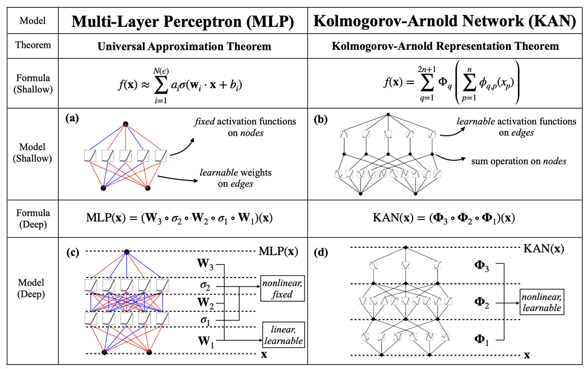
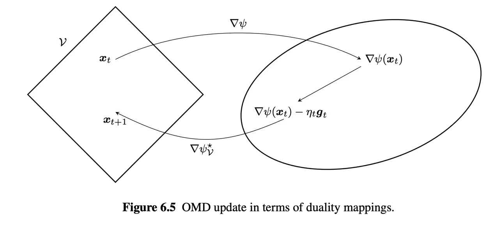

# Operationalizing Stein's Method for Online Linear Optimization

## Preliminaries of Online Linear Optimization

考虑一个 toy example：每一轮，算法选择一个决策 $x_t \in [-1,1]$，对手给出一个损失的梯度 $g_t \in [-1,1]$，算法承受的损失是 $g_t x_t$。假设共 $T$ 轮游戏，总的损失 $ \operatorname{Loss}_T = \sum_{t=1}^T g_t x_t $

算法的目标是在对对手没有任何先验了解的情况下，给出一个稳健的策略最小化 $ \operatorname{Loss}_T$，但 loss 是和问题的复杂度相关的： $ \operatorname{Loss}_T \le \operatorname{Bound}(\text{complexity of } g_1,...,g_T) $

所以，我们引入 regret 的概念来表示算法的表现在多大程度上偏离了最优的静态策略：

$$ \operatorname{Regret}_T (u) := \sum_{t=1}^T g_t (x_t - u), \forall u \in [-1, 1] $$

*Loss-regret Duality* 对于任何适当的闭凸函数 $\psi_T: [-1,1] \to (-\infty, \infty),$ $ \operatorname{Regret}_T (u) \le \psi_T (u), \forall u \in [-1, 1] \iff \operatorname{Loss}_T \le -\psi_T^*(-\sum_{t=1}^T g_t) $

其中 $\psi_T^*$ 是 $\psi_T$ 的对偶函数：$ \psi_T^* (s) = \sup_{x \in [-1,1]} (s x - \psi_T (x)) $

这告诉我们，证明关于 regret 的界和关于 loss 的界是相通的。

考虑最坏情况 uniform regret $ \operatorname{Regret}_T^{\text{unif}} = \sup_{u \in [-1,1]} \operatorname{Regret}_T (u) = \max \{\operatorname{Regret}_T (-1), \operatorname{Regret}_T (1)\} $

上式成立是因为 $\operatorname{Regret}_T (u)$ 是关于 $u$ 的线性函数。一个经典的目标是使得 $\operatorname{Regret}_T^{\text{unif}} \le c_T$，即取 $\psi_T = c_T$。 对应于 loss，可以得到 $ \operatorname{Loss}_T \le -|\sum_{t=1}^T g_t| + c_T $

在讨论最优算法之前，我们先考虑一个合理的算法。一个很自然的想法是 Empirical Risk Minimizer ：

$$ x_t = \operatorname{sign}(-\sum_{i=1}^{t-1} g_i) $$

这个策略过于激进，在最坏情况下，它可能导致总损失达到 $\Theta(T)$ 的量级。

一个稍作修正的想法是在这个基础上加入正则化，这就得到Online Gradient Descent：

$$ x_{t+1} = \operatorname{Proj}_{[-1,1]} [x_t - \eta g_t] $$

如果换一种方式来度量距离，则可以得到 Multiplicative Weight Update ：

$$ x_{t+1} = \tanh(-\eta \sum_{i=1}^t g_i) $$

OGD 和 MWU 都是一个更普适的框架 Mirror Descent 的特例。它们都能提供"合理"的后悔值和总损失上界。不过，我们在此不深入讨论，因为我们之后会介绍能超越它们的算法。

## Stein-based Algorithm and its Implications

我们从总损失的角度来分析算法的性能极限。如果一个算法能实现 $ \operatorname{Loss}_T \le -\psi_T^*(-\sum_{t=1}^T g_t) $ 的上界，那么这个 $\psi_T^*$ 函数必须满足一个"没有免费午餐"的必要条件。

考虑一个最简单的随机对手：每一轮的梯度 $g_t$ 都是 i.i.d. Rademacher。在这种情况下，任何合理的算法的期望损失都不应为负。这给了我们一个约束：

$$ E_{g_{1:T} \sim \text{Rad}} [\psi_T^* (\sum_{t=1}^T g_t)] \le 0 $$

根据中心极限定理，当 $T$ 很大时，梯度的总和 $\sum_{t=1}^T g_t$ 的分布可以用一个正态分布 $\mathcal{N}(0, T)$ 来近似。因此，上述约束可以近似为：

$$ E_{X \sim \mathcal{N}(0, T)} [\psi_T^*(X)] \le 0 $$

OLO 的性能极限，本质上是由一个关于高斯积分的不等式所决定的。最优的算法必须在其设计中"内嵌"这种概率渐近（在此例中为高斯）的行为。这正是镜像下降 Mirror Descent 等通用算法的不足之处，它们没有考虑到这种底层的概率结构。

*Achieving Additively Sharp Tradeoffs in OLO* 令 $\psi_T^*: \mathbb{R} \to \mathbb{R}$ 是任意 1-Lipschitz 的凸函数满足 $E_{X \sim \mathcal{N}(0,T)} [\psi_T^*(X)] = 0$，则存在 $O(1)$-time-per-round 算法满足

$$ \operatorname{Loss}_T \le -\psi_T^*(-\sum_{t=1}^T g_t) + O(\log T) $$

同时不存在任何算法保证

$$ \operatorname{Loss}_T \le -\psi_T^*(-\sum_{t=1}^T g_t) - \Omega(1) $$

$f$ 是一个满足 Stein Equation 的函数，$\rho_t = \sqrt{T-t}， s_t = \sum g_i$。标准的一维 OLO 求解算法是在每个时间步骤计算 $x_t$ 作为当前时间的决策： $ x_t := E_{Z \sim \mathcal{N}(0,1)} [f_{s_{t-1}, \rho_{t-1}, \psi_T^*} (s_{t-1} + \rho_t Z)] $

为了不陷入繁琐的细节，我们考虑一个简化的版本来构建直觉。把 $\rho_t \leftarrow \rho_{t-1}$，算法做的决策可以近似为

$$ \tilde{X}_t := E_{Z \sim \mathcal{N}(0,1)} [f_{s_{t-1}, \rho_{t-1}, \psi_T^*} (s_{t-1} + \boldsymbol{\rho_{t-1}} Z)] = - E_Z [ (\psi_T^*)' (s_{t-1} + \sqrt{T - t + 1} Z) ]. $$

OLO 的难点在于无法预知未来，但我们可以猜测未来的数据是高斯分布的，即假设 $g_t$ 服从高斯分布。在第 $t$ 轮，我们将 $X_t$ 选为（期望意义上的）事后最优决策：

$$ X_t \leftarrow E_{g_t, \dots, g_T \sim \mathcal{N}(0,1)} [ \operatorname{arg\,min}_{u \in [-1, 1]} \sum_{i=1}^T g_i u ] = E_{X \sim \mathcal{N}(s_{t-1}, T - t + 1)} [ \operatorname{arg\,min}_{u \in [-1, 1]} X u ]. $$

上述策略没有体现出我们想实现的 tradeoff。tradeoff 的具体含义是，你无法设计一个在所有可能场景下都做到最好的算法。你必须做出选择，你更看重在哪种场景下的性能，并愿意牺牲其他场景下的部分性能作为代价。

为了将我们预设的、由 $\psi_T^*$ 函数所描述的性能目标编码进算法中，我们需要在优化问题里加入一个正则项：

$$ \tilde{X}_t = E_{X \sim \mathcal{N}(s_{t-1}, T - t + 1)} [ \operatorname{arg\,min}_{u \in [-1, 1]} X u + \psi_T (-u) ] = - E_Z [ (\psi_T^*)' (s_{t-1} + \sqrt{T - t + 1} Z) ], $$

这恰好就是算法在做的决策（的近似）。

# Statistical Theory for Deep Neural Network

Why Theory?

- understand why deep learning works
- useful to extract key concepts
- comparsion with other methods,
- selection of tuning parameters
- detecting limitations of deep learning
- improvements (hybrid method)

## Theory of Shallow Networks

对于 $v=(v_1, \dots, v_r)^T, y=(y_1,\dots, y_r)^T$，定义 $\sigma_v: \mathbb{R}^r \to \mathbb{R}^r$ 为 $ \sigma_v (y) = (\sigma(y_1-v_1),\dots,\sigma(y_r-v_r))^T $

一个最简单的神经网络可以表示为 $ f(x)=W_L \sigma_{v_L} W_{L-1} \sigma_{v_{L-1}} \dots W_1 \sigma_{v_1}W_0 x $

Deep learning 指的是使用 gradient-based methods 来拟合数据的方法。考虑函数族 $ \mathcal{F}_{m,\sigma}=\{f = \sum_{j=1}^m c_j \sigma(w_j^T \cdot + v_j)\}: w_j \in \mathbb{R}^d, v_j, c_j \in \mathbb{R} $

为所有单层神经网络函数构成的集合。我们想考虑：（1）这个函数类有多大？（2）这个函数类能估计多光滑的函数？估计的误差如何？

*Universal approximation* 对于任意 $\epsilon>0$ 和 $[0,1]^d$ 上的连续函数 $f$，存在 $m=m(f,\epsilon)$， $ \inf_{g \in F_{m,\sigma}} \|f-g\|_{L^{\infty} ([0,1]^d)}\le \epsilon $

- 证明用到对多项式函数的显式构造，但是构造中有的参数很小，有的参数很大；
- 使用任意点处的激活函数值可以拟合一个特定的 $x^n$；
- 微小扰动会带来完全不同的性质；
- 如果 $\sigma$  universial approximation 的性质；

换一种形式，可以证明由 ridge functions 张成的空间 $ f=\sum_{j=1}^m g_j (w_j^T \cdot) $ 也具有 universal approximation property，其中 $g_j$ 是单元连续函数。

Fourier Transform 也有 uniform approximation 的性质，而且其形式上正是取了激活函数为 $\cos$ 的单层神经网络：$ f(x)=\frac{1}{(2\pi)^d} \int \cos (w^T x + \phi(w)) |\mathcal{F} f(w)| \mathrm{d} w $

假设 $f$ 是有限宽度的 shallow network，具有以下形式：$ x \to f(x)=\int c \sigma(w^T x + v) \mathrm{d} P(c,w,v) $

其中 $P$ 是 $\mathbb{R} \times \mathbb{R}^d \times \mathbb{R}$ 上的概率测度。将 $P(c,w,v)$ 写作 $P(c | w,v)P(w,v)$，则 $ x \to f(x) = \int \phi(w,v) \sigma(w^T x + v) \mathrm{d} P(w,v) $

其中 $\phi(w,v)=\int c \mathrm{d} P(c | w,v)$。

Maurey's theorem 指出，对于任意具有 $ f(x)=\int g(\theta, x) \mathrm{d} P(\theta) $ 形式的函数，总存在 $\theta_1, \dots, \theta_m \in \Theta$，使得对于任何测度 $Q$，$ \|f - \frac{1}{m} \sum_{j=1}^m g(\theta_j, \cdot)\|_{L^2 (Q)} \le \frac{\|g\|_{L^2 (P\otimes Q)}}{\sqrt{m}} $

$m^{-1/2}$ 的界还可以被改进，和参数空间的复杂度（用覆盖数刻画）以及激活函数 $\sigma$ 的 smoothness 有关。可以做到 $m^{-1/2 - s/D}$。 其中 smoothness 的定义是，存在 $K,C'$，对于任何 $\theta_* = (w_*,v_*) \in \Theta$ 和 $0<\epsilon<1$，可以找到 $(w_1,v_1),\dots,(w_K,v_K)$，使得对于任意的 $\theta = (w,v) \in \Theta \cap B(\theta_*, \epsilon)$，存在 $\lambda_1 (\theta),\dots, \lambda_K (\theta) \in [-C',C']$ 满足 $ \|w^T \cdot + v - \sum_{j=1}^K \lambda_j (\theta) \sigma(w_j^T \cdot + v_j)\| \le C' \epsilon^s $

直观理解，任何在 $\epsilon$-ball 中的神经元可以被 $K$ 个其他神经元的线性组合拟合，误差为 $\epsilon^s$。

给定一个有 $N$ 个参数的函数族 $\mathcal{F}_N$（比如神经网络），对于同一个 domain 内的函数族 $\mathcal{G}$，$\mathcal{F}$ 的拟合效果有多好？具体而言，$ r(N) = \sup_{g \in \mathcal{G}} \inf_{f \in \mathcal{F}_N} \|f-g\| $

计算 $r(N)$ 是不可能的，我们的兴趣更多集中在 $r(N)$ 趋向于0的速度上。

对于 $[0,1]^d$ 内的 $\beta$-smooth 函数，$r(N) \approx N^{-\beta/d}$。对于 分段常值函数，$\beta=1$，对于分段线性函数，$\beta=2$。有趣的是，对于 ReLu，$\beta=2+(d-1)/2$。

总而言之，对于 shallow network，我们有 universal approxiamtion，approxiamation rates 和 estimation risk bounds。关键的发现是：

- universal approximation is a weak guarantee；
- shallow ReLU networks 看似是分段线性，但有更高的 smoothness

## Advantages of Additional Layers

Localization 指拟合一个 support 有界的函数。Shallow network 无法做到 localization，但只要有两层 hidden layers，就可以做到。比如，$ \mathbf{1}(x \in [-1,1]^d) = \sigma_0 \left(\sum_{i=1}^d \sigma_0(x_i+1) + \sigma_0(-x_i +1) - 2d + \frac{1}{2}\right) $

其中 $\sigma_0 = 1(\cdot \ge 0)$ 是 Heaviside 激活函数。使用 ReLU 也可以，因为对于充分大的 $\alpha$，$\sigma(\alpha x) - \sigma(\alpha x - 1)\approx \sigma_0 (x)$。

估计 $x^2$ 的方式可以由导数定义的变形得到：$ \frac{\sigma(t+2x h) - 2\sigma(t + x h) - \sigma(t)}{\sigma''(t) h^2} \approx x^2 $

层叠起来就可以估计 $x^{2^k}$。

*Kolmogorov-Arnold representation theorem* 对于任何连续函数 $f: [0,1]^d \to \mathbb{R}$，存在单元连续函数 $g_q, \phi_{(p,q)}$ 使得 $ f(x_1,\dots,x_d)=\sum_{q=0}^{2d} g_q \left(\sum_{p=1}^d \psi_{(p,q)} (x_p)\right) $

注意，这里直接使用了等号。

存在实数 $a, b_p, c_q$ 和连续的单调函数 $\psi: \mathbb{R} \to \mathbb{R}$，使得对于任意连续函数 $f:[0,1]^d \to \mathbb{R}$，存在连续函数 $g: \mathbb{R} \to \mathbb{R}$ 使得 $ f(x_1,\dots,x_d) = \sum_{q=0}^{2 d} g\left(\sum_{p=1}^d b_p \psi(x_p + q a) + c_q\right) $

所有关于 $f$ 的信息都只包含在 $g$ 中。上面的形式和两层隐藏层的神经网络结构相似。不幸的是，$g$ 没有很好的连续性。

KAN 的好处是：有可学习的激活函数，在达到相同的估计质量时使用更少的参数，可解释性更强。

*Deep ReLU Network* 通过构造性证明，Deep ReLU 可以做到下面四个操作，这是别的方法很难做到的。

- *Representation of Identity* ReLU 满足 $\sigma \circ \sigma = \sigma$，所以可以拟合恒等函数；
- *Highly Oscillating Functions* 对于一个 $(p_1, \dots, p_L)$ 的 $L$ 层 ReLU 网络，其分段数高达 $ (3/2)^L \prod_{j=1}^L (p_j + 1) $，所以可以拟合复杂的折线。
- *Approximation of $x^2$ and $x y$* 通过基础的三角形函数 $T(x) = (2x)_+ - (4x-2)_+$，深度 ReLU 网络可以构造出有 $2^k$ 个尖峰的锯齿函数 $R^k$。进行级数求和 $\sum_{k=1}^m R^k (x)$，可以以 $O(4^{-m})$ 的速度逼近 $x(1-x)$，达到相同的误差浅层 ReLU 需要 $O(2^{m/2})$ 的参数。既然能逼近平方，利用极化恒等式 $ x y = ((x+y)/2)^2 - ((x-y)/2)^2 $ 就可以实现乘法操作。
- *Localization and Taylor Approximation* 如果能实现乘法，就可以在空间中实现 localization，在每个局部使用网络计算高阶 Taylor 展开，使得深度 ReLU 能够以 $N^{-\beta/d}$ 的速率逼近任何 $\beta$-smooth 函数。

## Double Descent and Implicit Regularization

明明 overparametrization 但是却有很好的泛化性，或许是因为 SGD 内含 implicit 。作者的观点是：

- Implicit regularization 不足以做 denoising；
- 但是在实际中还是有用，是因为数据集本身有很多相同的结构。

对于线性回归 $Y=X \beta + \epsilon$，使用均方损失 $\frac{1}{2} \|Y - X \beta\|^2$，梯度下降初始化 $\beta_0 = \tilde{\beta}_0 + \beta'$，其中 $\beta' \in \ker(X), \tilde{\beta}_0 \perp \ker(X)$。最小值点 $\beta^* \in \arg \min \{\|\beta\|, Y=X \beta\}$。

对于深度线性网络 $f(x)=W_L \dots W_0 x$，gradient flow 有性质 $ W_l^T W_l (t) - W_{l-1} (t) W_{l-1} (t)^T = \text{constant} $

加入 $L^2$ 正则化的梯度流能加速 $W_l^T W_l (t) \to W_{l-1} (t) W_{l-1} (t)^T$。

Benign overfitting, grokking.

# Denoising Diffusions: Optimal Rate of Discretisation in Wasserstein Distance

Wasserstein distance，考虑把一个分布的"质量"搬运成另一个分布所需要的最小代价。

设 $(X, d)$ 是一个度量空间，$\mu$ 和 $\nu$ 是定义在 $X$ 上的两个概率分布。对于 $p \ge 1$，$p$-Wasserstein distance 定义为

$$
W_p (\mu, \nu)
=
\left(
  \inf_{\gamma \in \Gamma(\mu, \nu)}
  \int_{X \times X} d(x, y)^p \mathrm{d} \gamma(x, y)
\right)^{1/p}.
$$

其中，$\Gamma(\mu, \nu)$ 表示所有以 $\mu$ 和 $\nu$ 为边缘分布的联合分布集合，也就是说

$$
\Gamma(\mu, \nu)
=
\left\{
  \gamma \in \mathcal{P}(X \times X) :
  \gamma(A \times X) = \mu(A),
  \gamma(X \times B) = \nu(B)
\right\}.
$$

直观地说，$\gamma(x, y)$ 描述了要把多少概率质量从位置 $x$ 搬运到位置 $y$。距离 $d(x, y)^p$ 是这次搬运的代价。因此 $W_p (\mu, \nu)$ 衡量的是：在所有可能的搬运方案中，把 $\mu$ 变成 $\nu$ 的最小平均搬运成本。

最常见的是二阶 Wasserstein distance：

$$
W_2(\mu, \nu)
=
\left(
  \inf_{\gamma \in \Gamma(\mu, \nu)}
  \int_{X \times X} \|x - y\|^2 \mathrm{d} \gamma(x, y)
\right)^{1/2}.
$$

如果在欧氏空间 $\mathbb{R}^d$ 上考虑两个随机变量 $X \sim \mu$ 和 $Y \sim \nu$，那么 Wasserstein distance 也可以写成 coupling 的形式：

$$
W_p (\mu, \nu)
=
\left(
  \inf_{X, Y: X \sim \mu, Y \sim \nu}
  \mathbb{E} [\|X - Y\|^p]
\right)^{1/p}.
$$

这里的 infimum 是在所有可能的联合构造 $(X, Y)$ 上取的。也就是说，虽然 $X$ 和 $Y$ 的边缘分布分别固定为 $\mu$ 和 $\nu$，但它们之间的相关性可以自由选择。Wasserstein distance 寻找的是让 $X$ 和 $Y$ 尽可能接近的最优联合方式。

在 diffusion theorem 中考虑 Wasserstein distance，主要是因为 diffusion model 的目标不是逐点恢复某一个样本，而是让生成分布接近真实数据分布。也就是说，我们关心的是

$$
P_{\theta} \approx P^*,
$$

其中 $P_{\theta}$ 是模型反向生成出来的分布，$P^*$ 是真实数据分布。为了严格描述"两个分布接近"，需要选择一个概率分布之间的距离。选择 Wasserstein distance 的理由如下。

第一，Wasserstein distance 有几何意义。如果两个分布的质量位置很接近，即使它们的密度支撑集不完全重合，Wasserstein distance 仍然可以给出有意义的、有限的距离。

例如，两个 Dirac 分布

$$
\mu = \delta_x, \quad \nu = \delta_y
$$

之间的总变差距离在 $x \neq y$ 时恒为

$$
\mathrm{TV}(\delta_x, \delta_y) = 1,
$$

但 Wasserstein distance 是

$$
W_p (\delta_x, \delta_y) = d(x, y).
$$

因此，如果 $x$ 和 $y$ 很接近，Wasserstein distance 也很小。这种性质非常适合描述生成样本位置上的小偏差。

第二，diffusion theorem 通常需要刻画误差如何从 score estimation error、discretization error、initialization error 传播到最终生成分布。Wasserstein distance 可以把路径层面的误差转化为分布层面的误差。例如，如果两个反向过程 $X_t$ 和 $Y_t$ 使用相同的 Brownian motion 耦合起来，那么可以通过估计

$$
\mathbb{E} \|X_T - Y_T\|^2
$$

来控制最终分布之间的 $W_2$ 距离：

$$
W_2^2(\mathrm{Law}(X_T), \mathrm{Law}(Y_T))
\le
\mathbb{E} \|X_T - Y_T\|^2.
$$

右边是随机过程路径之间的均方误差，而左边是两个最终分布之间的距离。通过这种 coupling argument，diffusion theorem 可以把 SDE 的稳定性分析转化为生成分布的误差界。

第三，在 diffusion model 中，真实数据分布可能集中在低维流形附近，而高斯噪声分布通常分布在整个高维空间中。KL divergence 或 total variation distance 在这种情况下可能过强，甚至可能因为支撑集不匹配而失去有用性。Wasserstein distance 对支撑集错位更加温和，因此更适合刻画生成模型中的几何误差。

因此，在 diffusion theorem 中使用 Wasserstein distance 的核心原因是：

$$
\text{trajectory error} \Longrightarrow \text{distribution error}.
$$

也就是说，理论证明通常先通过 SDE 稳定性控制两条随机轨迹之间的距离，再利用 coupling 关系推出最终生成分布和真实数据分布之间的 Wasserstein 距离上界。

以下用 $p$ 代表维度。

考虑 DDPM。首先生成 $X \sim P^*$。$P^*$ 不可知，我们只能知道 $ s^*(t,x) = \nabla_x \log \pi^* (t,x), \quad \pi^* (t,x) = \text{pdf of } (\overline{\alpha}_t X + \overline{\beta}_t \xi) $

其中 $\xi \sim \mathcal{N}_p (0,I)$，$\xi \perp\!\!\!\perp X \sim P^*, \overline{\alpha}_t = e^{-(T-t)}, \overline{\beta}_t^2 = 1 - \overline{\alpha}_t^2$。

(Anderson, 1982) 任选 $T>0$ 和 Brownian 随机变量 $B_t$，如果 $Y_0 \sim \pi^* (T, \cdot), Y_T = \mathrm{SDE}(T, s^*, B)_T$，则 $Y_T \sim P^*$。

这里 $\pi^* (T, \cdot)$ 表示经过 $T$ 时间加噪的数据分布，在实践中不可知。

(Idealised DDPM) 将 $\pi^* (T,\cdot)$ 替换为 $\mathcal{N}_p (0,I_p)$ 并离散化，于是 $Z_0 \sim \mathcal{N}_p (0,I_p), Z_K = \mathrm{Euler}(T, s^*, B, h)_K$，可得 $Z_{T/h} \sim P_{T/h}^{\mathrm{DD}}$

一个 informal 的结果是：如果 $P^*$ 是好的，那么 $ W_2 (P_{T,h}^{\mathrm{DD}}, P^*)\le C\sqrt{p}(\mathrm{Err}_T (Y_0,Z_0) + \mathrm{Err}_{T,h}(\mathrm{SDE},\mathrm{Euler})) $

Ornstein--Uhlenbeck 过程

$$
d X_t = - X_t \mathrm{d} t + \sqrt{2} \mathrm{d} B_t,
\quad t \ge 0,
\quad X_0 \sim P^*,
\quad (B_t)_{t \ge 0} \perp X_0.
$$

可以推出

$$ X_t = \alpha_t X_0 + \beta_t \xi $$

，其中

$$ \alpha_t = e^{-t} \text{ and } \beta_t = \sqrt{1 - \alpha_t^2}. $$

(Anderson, 1982) 存在一个 Brownian Motion $\tilde{B} \perp X_T$，使得过程

$$ Y_t = X_{T - t} $$

满足

$$
\mathrm{d} Y_t
=
\left(
  Y_t + 2 \nabla \log \pi^*(T - t, Y_t)
\right) \mathrm{d} t
+
\sqrt{2} \mathrm{d} \tilde{B}_t,
\quad 0 \le t \le T,
$$

其中 $\pi^*(t, x)$ 是 $X_t$ 的概率密度函数。

不可行算法：选择一个 $T > 0$，采样 $Y_0 \sim \pi^*(T, \cdot)$ 以及 $(\tilde{B}_t)_{[0, T]}$，然后输出 $Y_T$。

可行算法：选择一个离散化

$$ 0 = t_0 < \dots < t_K = T, $$

采样 $Z_0, \xi_i \overset{\text{iid}}{\sim} N(0, I)$，并按顺序计算

$$
Z_{k+1}
=
Z_k
+
h_k (
  Z_k + 2 \hat{s}(T - t_k, Z_k)
)
+
\sqrt{2 h_k} \xi_{k+1}.
$$

其中 $\hat{s}(T - t_k, Z_k)$ 是 score proxy，而 $\sqrt{2 h_k} \xi_{k+1}$ 对应于 $\sqrt{2}(B_{t_{k+1}} - B_{t_k})$。输出 $Z_{K - 1}$。

# Stochastic and Online Convex Optimization

Online convex optimization 是一个两方序贯博弈。算法每轮选择一个 $\theta_t \in \Theta$，对手给出一个损失函数 $l_t: \Theta \to \mathbb{R}$，算法在第 $t$ 轮承受损失为 $l_t (\theta_t)$。我们希望最小化 regret：$ \operatorname{Reg}_n (\theta^*) = \sum_{i=1}^n l_t (\theta_t) - \sum_{t=1}^n l_t (\theta^*) $

OCO 一般假设 $\Theta \subset \mathbb{R}^d$ 是闭凸集，且每个 $l_t$ 关于 $\theta$ 是凸函数。

Stochastic convex optimization 假设数即来自某个未知分布 $P$，期望最小化期望损失 $L(\theta) = \mathbb{E}_{P} l(\theta,Z)$，其中对每个 $z$，$l(\theta,z)$ 关于 $\theta$ 是凸函数。

如果我们把随机样本对应的损失函数看作 online 损失 $l_t (\theta) = l(\theta,Z_t)$，算法根据过去的样本 $Z_1,\dots,Z_{t-1}$ 选择 $\theta_t$，最后输出平均参数 $\overline{\theta_n} = \frac{1}{n} \sum_{i=1}^n \theta_t$，由于 $L(\theta)$ 是凸函数，由 Jensen 不等式，$ L(\overline{\theta}_n) \le \frac{1}{n} \sum_{i=1}^n L(\theta_t) $

又因为 $\theta_t$ 只依赖 $Z_1,\dots,Z_{t-1}$，$\theta_t$ 和 $Z_t$ 条件独立，因此 $L(\theta_t) = \mathbb{E}[l(\theta_t, Z_t)]$，所以 online 中对平均 regret 的控制，可以转化为对 stochastic objective $L(\overline{\theta}_n)$ 的收敛控制。OCO 更一般，SCO 可以看作 OCO 的一个特例。

## Projected Subgradient Method

在线凸优化的一般方法是，建立关于损失函数 $l_t$ 的模型，并在模型上做优化。我们定义在 $\theta_0$ 处损失 $l$ 的模型为 $\hat{l}(\cdot;\theta_0)$，满足（1）$\theta \to \hat{l}(\theta; \theta_0)$ 是凸且可求次梯度的；（2） $\hat{l}(\theta;\theta_0)\le l(\theta)$，在 $\theta=\theta_0$ 取等。最常见的模型是一阶模型，取 $g \in \partial l(\theta_0)$，取 $ \hat{l}(\theta; \theta_0) = l (\theta_0) + \langle g, \theta - \theta_0 \rangle $

最基本的梯度下降方法是 projected subgradient methods。每一轮，预测 $\theta_t$ 并承受 $l_t (\theta_t)$。然后，取 $g_t \in \partial l_t (\theta_t)$，更新 $ \theta_{t+1} = \arg \min_{\theta \in \Theta} \left\{\langle g_t, \theta \rangle + \frac{1}{2 \eta_t} \|\theta - \theta_t\|_2^2\right\} $

一方面,希望沿着当前损失 $l_t$ 的一阶近似下降，即让 $\langle g_t, \theta \rangle$ 尽可能小；另一方面又不希望新的点离 $\theta_t$ 太远，因此加入二次正则项 $\frac{1}{2 \eta_t} \|\theta - \theta_t\|_2^2$。

由于这里使用的是欧氏距离，更新可以等价写成两步：

$$
\theta_{t+1/2} = \theta_t - \eta_t g_t,
\quad
\theta_{t+1} = \operatorname{Proj}_{\Theta} (\theta_{t+1/2}).
$$

也就是说，先做一次普通的 subgradient descent，再把结果投影回可行域 $\Theta$：

$$
\operatorname{Proj}_{\Theta} (v) = \arg \min_{\theta \in \Theta} \|\theta - v\|_2^2.
$$

因此这个方法叫 projected subgradient method。具体的收敛结果如下：

$$
\sum_{t=1}^n [l_t (\theta_t) - l_t (\theta)]
\le
\frac{1}{2 \eta} \|\theta_1 - \theta\|_2^2
+
\frac{\eta}{2} \sum_{t=1}^n \|g_t\|_2^2.
$$

这是因为

$$
\|\theta_{t+1} - \theta\|_2^2
\le \|\theta_t - \eta g_t - \theta\|_2^2 =
\|\theta_t - \theta\|_2^2
- 2 \eta \langle g_t, \theta_t - \theta \rangle +
\eta^2 \|g_t\|_2^2.
$$

由于 $g_t \in \partial l_t (\theta_t)$，由凸函数的一阶条件，代入前面的 one-step progress，可得

$$
\|\theta_{t+1} - \theta\|_2^2
\le
\|\theta_t - \theta\|_2^2
-2 \eta [l_t (\theta_t) - l_t (\theta)] +
\eta^2 \|g_t\|^2
$$

对 $t = 1, \dots, n$ 求和，可得

$$
\sum_{t=1}^n [l_t (\theta_t) - l_t (\theta)]
\le
\frac{1}{2 \eta} \|\theta_1 - \theta\|_2^2
+
\frac{\eta}{2} \sum_{t=1}^n \|g_t\|_2^2.
$$

这就是 projected subgradient method 的基本 regret bound。这个 bound 可以解释为两部分：$\frac{1}{2 \eta} \|\theta_1 - \theta\|_2^2$ 表示初始化点 $\theta_1$ 和参考点 $\theta$ 的距离造成的代价。步长 $\eta$ 越大，这一项越小。$\frac{\eta}{2} \sum_{t=1}^n \|g_t\|_2^2$ 表示每一步次梯度带来的累计波动。步长 $\eta$ 越大，这一项越大。所以步长 $\eta$ 的选择是在这两项之间做平衡。

如果进一步假设可行域和次梯度都有界：

$$
\Theta \subset \{\theta \in \mathbb{R}^d : \|\theta\|_2 \le R_2\},
\quad
\|g\|_2 \le G_2,
$$

并且取 $\theta_1 = 0$，则对任意 $\theta^{\star} \in \Theta$，

$$
\|\theta_1 - \theta^{\star}\|_2 \le R_2,
\quad
\sum_{t=1}^n \|g_t\|_2^2 \le n G_2^2.
$$

代入 regret bound：

$$
\sum_{t=1}^n [l_t (\theta_t) - l_t (\theta^{\star})]
\le
\frac{R_2^2}{2 \eta} + \frac{\eta n G_2^2}{2}.
$$

为了平衡两项，取

$$
\eta = \frac{R_2}{G_2 \sqrt{n}}.
$$

于是得到

$$
\sum_{t=1}^n [l_t (\theta_t) - l_t (\theta^{\star})]
\le
R_2 G_2 \sqrt{n}.
$$

因此 projected subgradient method 可以得到 $O(\sqrt{n})$ 的 regret：

$$
\operatorname{Reg}_n (\theta^{\star}) = O(R_2 G_2 \sqrt{n}).
$$

## Mirror Descent Methods

定义一种新散度 Bregman divergence $\psi: \mathbb{R}^d \to \mathbb{R}$：$ D_{\psi} (w,v) = \psi(w) - \psi(v) - \langle \nabla \psi (v), w - v \rangle $

Bregman divergence 恒非负。如果取 $\psi(w) = \frac{1}{2} \|w\|_2^2$，那 $D(w,v)=\frac{1}{2} \|w-v\|_2^2$。更一般地，如果取 $\psi(w)=\frac{1}{2} w^T A w$，则 $ D_{\psi} (w,v) = \frac{1}{2} (w-v)^T A (w-v) = \frac{1}{2} \|w-v\|_A^2 $

如果取 $\psi(w) = \sum_{j=1}^d w_j \log w_j$，那么 $D_{\psi} (w,v) = D_{\mathrm{kl}} (w || v)$。

更一般的 mirror descent algorithm 建立在 Bregma divergence 上。每一轮，预测 $\theta_t \in \Theta$ 并承受损失 $l_t (\theta_t)$。然后，建立 $l_t$ 在 $\theta_t$ 处的模型 $\hat{l}_t$，然后做 non-Euclidean update: $ \theta_{t+1} = \arg \min_{\theta \in \Theta} \left\{\hat{l}(\theta; \theta_t) + \frac{1}{\eta_t} D_{\psi} (\theta, \theta_t)\right\} $

为什么叫 mirror descent？可以从对偶空间的角度考虑，$g_t \in V^*$ 在对偶空间中。$\psi$ 是一个 distance-generating function，把原始空间中的点映射到对偶空间中的点，经过更新后再映射回来。

当 mirror descnt 选择负熵作为 distance-generating function，并且可行域是概率单纯形时，mirror descent 的更新会变成 exponentiated gradient。

考虑概率单纯形：

$$
\Theta = \Delta_d = \{v \in \mathbb{R}_+^d : \langle 1, v \rangle = 1\}.
$$

在单纯形上，$\psi(w) = \sum_j w_j \log w_j$ 诱导出的 Bregman divergence 是

$$D_{\psi} (w, v) = \sum_j w_j \log (w_j / v_j)$$。

$$
\arg \min_{\theta \in \Delta_d}
\left\{
\langle g_t, \theta \rangle
+
\frac{1}{\eta_t} \sum_j \theta_j \log (\theta_j / \theta_{t,j})
\right\}.
$$

这个式子的含义是：第一项 $\langle g_t, \theta \rangle$ 希望沿着当前损失的下降方向移动；第二项是 KL 正则项，限制新的概率分布 $\theta$ 不要离旧的概率分布 $\theta_t$ 太远。因此这个算法是在概率单纯形上使用 KL geometry 的 mirror descent。

为推导显式更新，记 $v = \theta_t$，并考虑如下优化问题：

$$
\operatorname{minimize}_{\theta}
\quad
\langle g, \theta \rangle
+
\frac{1}{\eta} \sum_j \theta_j \log (\theta_j / v_j)
\quad
\text{subject to } \theta \in \Delta_d.
$$

用 Lagrangian 乘子法，最终可以得到 $ \theta_{t+1,i} = \frac{\theta_{t, i} e^{-\eta_t g_{t,i}}}{\sum_j \theta_{t,j} e^{-\eta_t g_{t,j}}} $

这里的更新是乘法形式，每个坐标的权重都会被乘上一个指数因子，$\theta_{t+1,i} \propto \theta_{t,i} \exp(-\eta_t g_{t,i})$。 这种算法适合概率分布，权重分配，专家问题等场景，因为它天然保证 $\theta_{t+1,i}\ge 0, \sum_i \theta_{t+1,i}=1$。

对 mirror descent 的收敛性分析如下。定义 dual norm $ \|y\|_* = \sup_{\|x\|\le 1} x^T y $

这里的对偶仍然可以从对偶空间的角度理解。$y$ 可以看作原空间对偶空间中的元素。$l_2$ 的对偶还是 $l_2$，$l_1$ 和 $l_{\infty}$ 互为对偶。

称 $\psi:\mathbb{R}^d \to \mathbb{R}$ 是关于 $\|\cdot\|$ 的强凸函数，若 $ \psi(v) \ge \psi(w) + \langle g, v-w \rangle + \frac{1}{2} \|w-v\|^2 $

Euclidean 是强凸函数。negative entropy 是强凸函数。$\psi(w)=\frac{1}{2 (p-1)} \|w\|_p^2,(1<p\le 2)$ 也关于 $l_p$ 强凸。当维度 $d\ge 3$ 时，考虑 $p = 1 + \frac{1}{\log d}$，由于 $\|w\|_1 \le d^{(p-1)/p} \|w\|_p$，所以 $\|w\|_p \ge d^{(1-p)/p}\|w\|_1 \ge e^{-1}\|w\|_1$，所以 $ D_{\psi} (w,v) \ge \frac{1}{2} \|w-v\|_p^2 \ge \frac{1}{2e^2}\|w-v\|_1^2 $

引入 p-norm 的目的是为了构造一个在 $l_1$ 下强凸的 distance-generating function $\psi$，让 mirror dscent 可以处理更一般的 $l_1$-geometry，而非局限在概率 simplex 上。选取 $p=1+\frac{1}{\log d}$ 可以让 $l_p$ norm 充分接近 $l_1$ norm。

设 $l_t$ 是任意一列凸函数，并且 $\theta_t$ 由 mirror descent 生成。假设 distance-generating function $\psi$ 关于范数 $\|\cdot\|$ 是强凸的，该范数对应的对偶范数为 $\|\cdot\|_* $。那么对于一列次梯度 $g_t \in \partial l_t (\theta_t)$，有如下结论。

(a) 如果对所有 $t$ 都有 $\eta_t = \eta$，那么对任意 $\theta^{\star} \in \Theta$，

$$
\sum_{t=1}^n [l_t (\theta_t) - l_t (\theta^{\star})]
\le
\frac{1}{\eta} D_{\psi} (\theta^{\star}, \theta_1)
+
\frac{\eta}{2} \sum_{t=1}^n \|g_t\|_*^2.
$$

(b) 如果 $\Theta$ 是紧集，并且对任意 $\theta \in \Theta$ 都有

$$
D_{\psi} (\theta^{\star}, \theta) \le R^2,
$$

那么

$$
\sum_{t=1}^n [l_t (\theta_t) - l_t (\theta^{\star})]
\le
\frac{1}{\eta_n} R^2
+
\sum_{t=1}^n \frac{\eta_t}{2} \|g_t\|_*^2.
$$

上述定理告诉我们，在一般的非欧几何下，mirror descent 也可以得到和 projected gradient descent 类似的 regret bound。

# Conservative Optimisim with Pessimistic Baselines for Offline-to-online Learning

## Multi-armed Bandits

Multi-armed bandits 的问题设定是：有 $K$ 种 action， 每种 action 的回报是未知的 $\mu_i$。在第 $t$ 论，选择动作 $a_t$，并观察到 reward $r_t \sim P_{a_t}$（未知，均值为 $\mu_{a_t}$）。目标是最小化 regret： $ R_T = \mathbb{E} [\sum_{t=1}^T (\mu^* - \mu_{a_t})], \mu^* = \max_i \mu_i $

最主要的挑战是：如何平衡 exploration 和 exploitation？

一种常见的准则是 Upper Confidence Bound (UCB)。令 $ U_i (t) = \hat{\mu}_i (t) + \sqrt{\frac{\log (1/\delta)}{T_i (t)}} $

前者代表 empirical mean，后者代表 uncertanty bonus。对于访问次数比较少的 action，给予其较大的潜力。令 $\Delta_i = \mu^* - \mu_i$ UCB 保证 $ R_T = O\left(\sum_{\Delta_i >0} \frac{\log T}{\Delta_i}\right), \quad \underbrace{R_T = O(\sqrt{K T})}_{\text{worst-case regret}} $

有时候我们已经有一些历史数据 $D_0 = \{N_i, \{y_{i,s}\}_{s=1}^{N_i}\}_{i=1}^K$。假设我们执行 $a_0 = \pi(D_0)$， 目标是 $\min R_0 = \mathbb{E}[\mu^* - \mu_{a_0}]$，这是一个 offline bandits。

一种常见的准则是 Lower Confidence Bound (LCB)。令 $\hat{\mu}_i (0)$ 表示 offline empirical mean，定义 $ L_i (0) = \hat{\mu}_i (0) - \sqrt{ \frac{\log (1/\delta)}{N_i}} $

这是一种悲观的策略，认为被遍历到的次数比较少的 action 可能并没有想象的那么好。LCB 保证至少有 $1-\delta$ 的概率，$ R_0 (\text{LCB}) = O(\sqrt{1/N_{\min}}), \quad R_T (\text{LCB}) = T \cdot R_0 (\text{LCB}) $

我们当然可以把 offline 和 online learning 结合起来。在 $T$ 比较小的时候，LCB 更好。在 $T$ 比较大的时候，UCB 更好。于是我们好奇，具体什么时候用 UCB，什么时候用 LCB 呢？首先看最坏情况：

| *Algorithm* | $T = 1$ | $T = N$ | $T \gg N$ |
|:---:|:---:|:---:|:---:|
| UCB | $O(\sqrt{1 / N_{\min}})$ | $O(N \sqrt{K / (\sum_{i} N_i)})$ | $O(\sqrt{K T})$ |
| LCB | $O(\sqrt{1 / N_{\min}})$ | $O(N \sqrt{1 / N_{\min}})$ | $O(T \sqrt{1 / N_{\min}})$ |

再看 gap-dependent regret：

| Algorithm | Gap-dependent regret |
|:---:|:---:|
| UCB | $O\left(\sum_{i: \Delta_i > 0} \left(\frac{\log(1 / \delta)}{\Delta_i} - N_i \Delta_i\right)_+\right)$ |
| LCB | $O\left(T \cdot \min_{i \in [K]} \left\{\Delta_i + \sqrt{\frac{\log(1 / \delta)}{N_i}}\right\}\right)$ |

我们无法找到一个具体的 $T_0$ 作为切换两种方法的静态阈值。

## From Static Switching to Credit Control

不提前固定策略，而是在每一轮根据当前信息动态判断，这一轮能不能承受 optimistic exploration 的风险。具体来说，定义预算 budget = cumulative reward - LCB baseline，即

$$
  B_t = \sum_{s=1}^t \mu_s - t \mu_{\text{LCB}}
$$

如果 $B_t > 0$，说明目前表现超过了 LCB 基准，可以拿一部分出去探索；如果 $B_t \le 0$，则说明没有足够预算，应该回到更保守的 LCB baseline。

定义 regret 为

$$
  R_T = T \mu^* - \sum_{t=1}^T \mu_t
$$

regret 越小越好。理想情况下，希望对每个 horizon $T$ 都有

$$
  \sum_{t=1}^T \mu_t \ge T \mu_{\text{LCB}}
$$

也就是说，算法的累计收益不能低于一直使用 LCB baseline 的收益。但是这个约束有时过强，因此可以引入容忍参数 $\alpha$，放宽为

$$
  \sum_{t=1}^T \mu_t \ge (1 - \alpha) T \mu_{\text{LCB}}
$$

其中 $\alpha \in [0,1]$。当 $\alpha = 0$ 时，约束没有放宽；当 $\alpha > 0$ 时，允许算法用一部分收益作为探索代价。

具体算法如下。首先从 offline data 中选择一个 pessimistic baseline。对每个 arm，根据历史样本计算它的 lower confidence bound：

$$
  \hat{\mu}_i (0) - \sqrt{\log(1 / \delta) / N_i}
$$

其中 $\hat{\mu}_i (0)$ 表示只使用 offline data 得到的第 $i$ 个 arm 的样本均值，$N_i$ 是第 $i$ 个 arm 的历史样本数，$\sqrt{\log(1 / \delta) / N_i}$ 是置信半径。选择 offline LCB arm：

$$
  a_0 \in \arg \max_{i \in [K]} \left\{
    \hat{\mu}_i (0) - \sqrt{\log(1 / \delta) / N_i}
  \right\}
$$

这个 $a_0$ 被固定为 pessimistic baseline。它不是样本均值最大的 arm，而是下置信界最大的 arm，因此更保守、更安全。

在线阶段，在每一轮 $t$，用 offline data 和 online data 的混合数据计算 optimistic candidate。对每个 arm 定义

$$
  U_i(t)
  =
  \hat{\mu}_i(t, N)
  +
  \sqrt{\log(1 / \delta) / (N_i + T_i (t))}
$$

其中 $T_i(t)$ 表示在线阶段到第 $t$ 轮前，第 $i$ 个 arm 已经被选择的次数。因此 $N_i + T_i (t)$ 是第 $i$ 个 arm 的总样本量：

$$
  \text{total samples}
  =
  \text{offline samples}
  +
  \text{online samples}
$$

置信半径可以记为

$$
  \mathrm{rad}_i (t, N)
  =
  \sqrt{\log(1 / \delta) / (N_i + T_i (t))}
$$

于是

$$
  U_i (t) = \hat{\mu}_i (t, N) + \mathrm{rad}_i (t, N)
$$

然后选择 UCB 最大的 arm 作为 optimistic candidate：

$$
  I_t \in \arg \max_{i \in [K]} U_i (t)
$$

这里 $I_t$ 只是 UCB 推荐的候选动作，还不是算法最终执行的动作。最终是否执行 $I_t$，还要看 exploration budget 是否足够。

令 $\mathcal{U}_{t-1}$ 表示前 $t-1$ 轮中算法接受 UCB candidate 的轮次集合，令 $\mathcal{B}_{t-1}$ 表示前 $t-1$ 轮中算法回退到 LCB baseline 的轮次集合。在第 $t$ 轮，如果考虑接受 UCB candidate $I_t$，则定义 certified credit：

$$
  \zeta_t
  =
  \sum_{s \in \mathcal{U}_{t-1}} \mu_{a_s}
  +
  |\mathcal{B}_{t-1}| \mu_{a_0}
  +
  \mu_{I_t}
  -
  (1 - \alpha) t \mu_{a_0}
$$

具体来看，前三项

$$
  \sum_{s \in \mathcal{U}_{t-1}} \mu_{a_s}
  +
  |\mathcal{B}_{t-1}| \mu_{a_0}
  +
  \mu_{I_t}
$$

表示如果第 $t$ 轮接受 $I_t$，那么到第 $t$ 轮为止的累计期望收益。其中第一项是过去接受 UCB 的轮次收益，第二项是过去回退到 baseline $a_0$ 的轮次收益，第三项是当前候选 arm $I_t$ 的收益。最后一项 $(1 - \alpha) t \mu_{a_0}$ 是放宽后的 baseline 累计收益。因此决策规则为

$$
  a_t =
  \begin{cases}
    I_t & \zeta_t \ge 0, \\
    a_0 & \zeta_t < 0,
  \end{cases}
$$

实际操作过程中，用 $L_i (t)$ 代替未知的 $\mu_{a_s}$，用 $U_{a_0} (t)$ 代替 $T_{\mu \text{LCB}}$。
